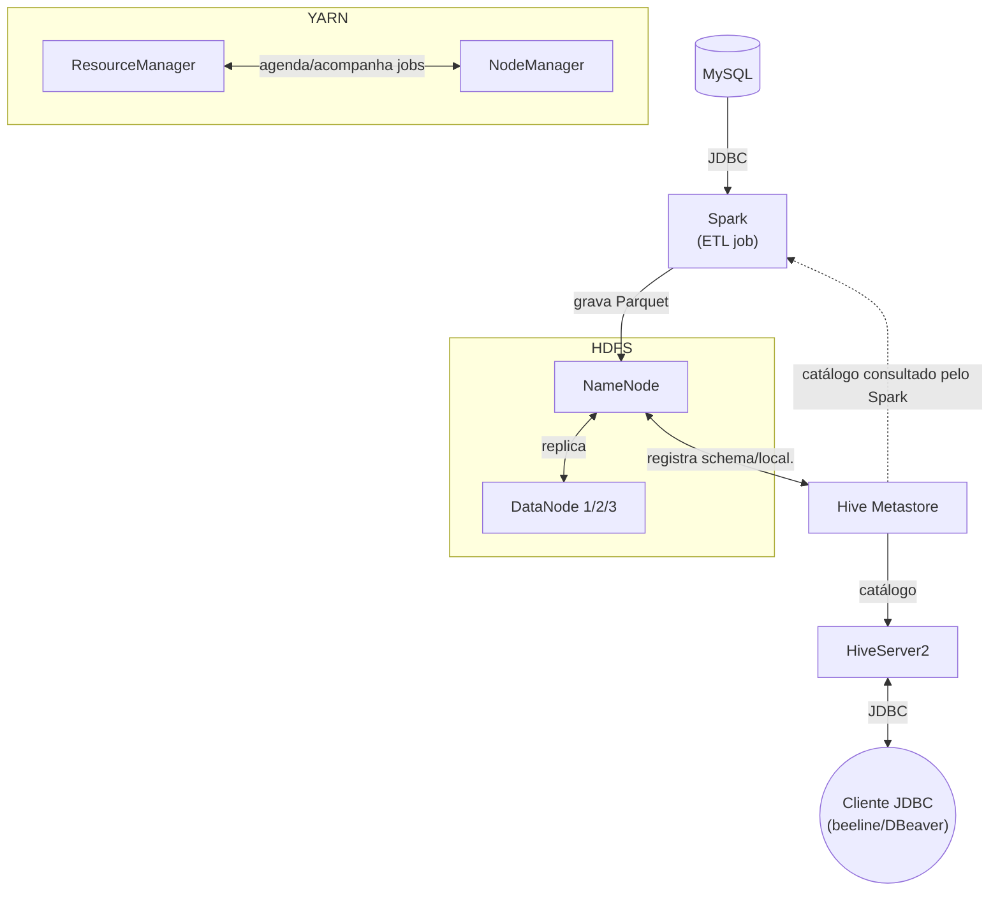

# Hadoop Lab — HDFS + MapReduce + Spark com Docker

Este laboratório sobe um mini cluster Hadoop completo no seu computador, usando Docker, para você experimentar na prática os conceitos vistos em aula: armazenamento distribuído (HDFS), processamento distribuído (MapReduce e Spark) e catálogo de metadados (Hive Metastore).

A ideia não é decorar comandos, e sim **entender o que acontece por trás de cada um** — por isso cada seção abaixo começa com o conceito antes do comando.

## O que você vai praticar

1. Subir um cluster Hadoop com múltiplos nós usando Docker Compose, camada por camada (HDFS → YARN → Hive/MySQL/Spark).
2. Gravar e ler arquivos no HDFS e ver como ele replica os dados entre nós.
3. Rodar um job MapReduce clássico (contagem de palavras) e acompanhar sua execução no YARN.
4. Rodar um job de ETL em Spark que lê de um banco relacional (MySQL), grava em Parquet no HDFS e registra a tabela no Hive Metastore.
5. Consultar a tabela registrada via JDBC (HiveServer2/beeline), além do Spark SQL.

## Arquitetura do cluster

As imagens usadas são as oficiais [apache/hadoop](https://hub.docker.com/r/apache/hadoop), [apache/hive](https://hub.docker.com/r/apache/hive) e [apache/spark-py](https://hub.docker.com/r/apache/spark-py). Cada serviço roda em um container separado, simulando máquinas diferentes de um cluster real:

| Camada | Serviços | Para que serve |
|---|---|---|
| **HDFS** (armazenamento) | 1 NameNode + 3 DataNodes | Sistema de arquivos distribuído. O NameNode guarda os metadados (onde está cada arquivo); os DataNodes guardam os blocos de dados de fato. Fator de replicação 3 = cada bloco fica copiado em 3 nós diferentes, para tolerar falhas. |
| **YARN** (orquestração) | ResourceManager + NodeManager + JobHistory Server | Gerenciador de recursos do cluster: decide onde cada job roda e acompanha sua execução. O JobHistory guarda o histórico de jobs concluídos. |
| **Hive Metastore** | Metastore + Postgres | Catálogo central de tabelas (nome, colunas, schema, localização no HDFS). Tanto o Hive quanto o Spark consultam esse catálogo para saber "o que é a tabela X e onde ela está". Fala Thrift (`9083`), não SQL. |
| **HiveServer2** | HiveServer2 | Servidor que executa SQL de fato e expõe uma porta **JDBC** (`10000`) para clients como `beeline` ou DBeaver. Usa o mesmo catálogo do Hive Metastore para saber onde estão os dados. |
| **Spark** (processamento) | Spark Master + Spark Worker | Motor de processamento distribuído, usado aqui para rodar um ETL: MySQL → Parquet no HDFS → tabela no Hive. |
| **MySQL** | 1 instância | Simula um banco transacional de origem (ex.: o banco de um sistema de RH), de onde o ETL extrai os dados. |



## Pré-requisitos

- Docker e Docker Compose instalados.
- Portas livres na sua máquina: `9870`, `8020`, `8088`, `19888`, `8080`, `8081`, `3306`, `9083`, `10000`, `10002`.

## 1. Subir o ambiente: começando pelo HDFS

Em vez de subir os 11 containers de uma vez com `docker compose up -d`, vamos subir o cluster **em camadas**, na mesma ordem em que vamos usá-lo: primeiro o HDFS (usado na seção 3), depois o YARN (seção 4) e por último Hive Metastore + MySQL + Spark (seção 5). Assim fica mais fácil relacionar cada container com o que ele faz, em vez de ver uma parede de serviços subindo de uma vez.

```bash
cd hadoop/hadoop_lab
docker compose up -d namenode datanode1 datanode2 datanode3
```

Isso constrói (se necessário) e inicia só o NameNode e os 3 DataNodes — o suficiente para os testes de HDFS da seção 3. Os demais serviços do `docker-compose.yml` (YARN, Hive, Spark, MySQL) continuam parados até serem chamados explicitamente nas seções seguintes.

**Por que esperar o NameNode ficar "healthy"?** Quando o HDFS sobe pela primeira vez, o NameNode entra em *safe mode*: um estado de só-leitura em que ele ainda está verificando se já recebeu relatórios de blocos suficientes dos DataNodes. Os DataNodes só conseguem se registrar depois que o NameNode está pronto — por isso o `docker-compose.yml` faz os DataNodes esperarem o `healthcheck` do NameNode (`depends_on: condition: service_healthy`).

Acompanhe a inicialização com:

```bash
docker compose ps
```

Espere `namenode`, `datanode1`, `datanode2` e `datanode3` aparecerem como `healthy`/`running` antes de seguir para os testes. Os demais serviços ainda não vão aparecer nessa lista — é esperado, eles só são iniciados nas seções 4 e 5.

## 2. Acessar as interfaces web

Cada serviço expõe uma UI onde dá para acompanhar visualmente o que está acontecendo — vale a pena deixar aberta enquanto roda os exercícios. Como o ambiente está subindo aos poucos, nem todas vão responder agora: use esta tabela como referência e volte a ela conforme for subindo cada camada nas seções seguintes.

| Interface | URL | O que observar |
|---|---|---|
| NameNode Web UI | http://localhost:9870 | Aba "Datanodes" → confirme que os 3 DataNodes estão ativos (`In Service`) |
| ResourceManager Web UI | http://localhost:8088 | Aplicações em execução/concluídas e NodeManagers registrados |
| JobHistory Web UI | http://localhost:19888 | Detalhes de jobs MapReduce já concluídos (contadores, tempo de execução) |
| Spark Master Web UI | http://localhost:8080 | Workers conectados e aplicações Spark em execução |
| Spark Worker Web UI | http://localhost:8081 | Recursos (CPU/memória) do worker e executors rodando |
| HiveServer2 Web UI | http://localhost:10002 | Sessões e queries SQL em execução/concluídas |

Outros acessos úteis (via linha de comando, não browser):

- HDFS RPC (cliente fora do container): `hdfs://localhost:8020`
- MySQL: `localhost:3306`, database `impacta`, usuário `root` / senha `root123`
- Hive Metastore (Thrift): `thrift://localhost:9083`
- HiveServer2 (JDBC): `jdbc:hive2://localhost:10000/default`

## 3. Testar o HDFS: gravando e lendo arquivos distribuídos

**Conceito:** no HDFS, um arquivo é dividido em blocos e cada bloco é replicado em vários nós (aqui, fator de replicação 3). Isso significa que mesmo que um DataNode caia, o arquivo continua acessível pelos outros dois.

```bash
# cria um diretório no HDFS (assim como mkdir, mas no sistema de arquivos distribuído)
docker exec namenode hdfs dfs -mkdir -p /user/aluno

# grava um arquivo de teste
echo "hello hdfs" | docker exec -i namenode hdfs dfs -put - /user/aluno/teste.txt

# lê o arquivo de volta
docker exec namenode hdfs dfs -cat /user/aluno/teste.txt

# inspeciona onde os blocos desse arquivo foram parar
docker exec namenode hdfs fsck /user/aluno/teste.txt -files -blocks -locations
```

**O que observar no `fsck`:** a saída deve mostrar `Live_repl=3`, com os blocos distribuídos entre `datanode1`, `datanode2` e `datanode3` — prova de que a replicação está funcionando.

## 4. Subir o YARN e testar o MapReduce: contagem de palavras (word count)

Para rodar um job MapReduce precisamos das peças do YARN, que ainda não foram iniciadas: o ResourceManager (agenda os jobs), o NodeManager (executa as tarefas de map/reduce) e o JobHistory Server (guarda o histórico de jobs concluídos).

```bash
docker compose up -d resourcemanager nodemanager historyserver
docker compose ps
```

`resourcemanager` e `nodemanager` não têm `healthcheck` definido — basta esperarem aparecer como `Up` no `docker compose ps` (poucos segundos) antes de submeter o job abaixo.

**Conceito:** o MapReduce processa dados em duas fases. A fase *Map* lê os dados de entrada e emite pares `(palavra, 1)` para cada ocorrência; a fase *Shuffle/Sort* agrupa e ordena esses pares por chave (palavra), distribuindo-os entre os reducers conforme um hash da chave; a fase *Reduce* soma as ocorrências de cada palavra. O YARN é quem decide em qual nó cada tarefa de map/reduce roda.

Rodamos aqui com **2 reducers** (`-D mapreduce.job.reduces=2`) para deixar visível que cada reducer processa um subconjunto das palavras e grava seu próprio arquivo de saída:

```bash
docker exec namenode sh -c "
  hdfs dfs -mkdir -p /user/aluno/wordcount/input
  echo 'hadoop mapreduce hdfs yarn hadoop yarn hadoop' | hdfs dfs -put - /user/aluno/wordcount/input/text.txt
  hadoop jar /opt/hadoop/share/hadoop/mapreduce/hadoop-mapreduce-examples-3.4.2.jar wordcount \
    -D mapreduce.job.reduces=2 \
    /user/aluno/wordcount/input /user/aluno/wordcount/output
"
# lista os arquivos de saída: um part-r-000XX por reducer
docker exec namenode hdfs dfs -ls /user/aluno/wordcount/output
docker exec namenode hdfs dfs -cat /user/aluno/wordcount/output/part-r-00000
docker exec namenode hdfs dfs -cat /user/aluno/wordcount/output/part-r-00001
```

O resultado esperado é a contagem de cada palavra do texto de entrada (ex.: `hadoop` aparecendo 3 vezes, `yarn` 2 vezes, etc.), só que dividida entre `part-r-00000` e `part-r-00001` — cada palavra aparece em um único arquivo, conforme o reducer para o qual foi roteada na fase de Shuffle/Sort.

Enquanto o job roda, acompanhe em http://localhost:8088 (aplicação em andamento, com as tarefas de map e reduce listadas separadamente); depois de concluído, os detalhes ficam disponíveis em http://localhost:19888.

## 5. Subir Hive Metastore, MySQL e Spark e testar o ETL: MySQL → HDFS (Parquet) → Hive

Por último, sobe a camada de ETL: o MySQL (fonte de dados), o Hive Metastore (catálogo), o HiveServer2 (consulta SQL/JDBC) e o Spark (Master + Worker):

```bash
docker compose up -d mysql hive-metastore-db hive-metastore hiveserver2 spark-master spark-worker
docker compose ps
```

Espere `mysql`, `hive-metastore-db` e `hive-metastore` ficarem `healthy`/`Up` antes de submeter o job — o `spark-master` já depende deles via `depends_on`, mas, se a máquina estiver lenta, vale conferir com `docker compose ps` antes de seguir.

**Conceito:** este é um pipeline de ETL típico de engenharia de dados — extrai de um banco transacional, transforma/grava em um formato colunar otimizado para analytics (Parquet) e registra a tabela em um catálogo (Hive Metastore) para que outras ferramentas (Spark SQL, BI, etc.) consigam consultá-la sem precisar saber onde o arquivo físico está.

O MySQL já sobe com uma base `impacta` e uma tabela `employees` de exemplo (veja [mysql/init.sql](mysql/init.sql)). O job [spark/jobs/etl_employees.py](spark/jobs/etl_employees.py) lê essa tabela via JDBC, grava o resultado em Parquet no HDFS e registra a tabela `impacta.employees` no Hive Metastore (`saveAsTable`).

Submeta o job ao cluster Spark:

```bash
docker exec spark-master /opt/spark/bin/spark-submit \
  --master spark://spark-master:7077 \
  /opt/spark/work-dir/jobs/etl_employees.py
```

Agora confira o resultado em cada camada do pipeline:

```bash
# 1) O arquivo Parquet foi realmente gravado no HDFS?
docker exec namenode hdfs dfs -ls /user/hive/warehouse/impacta.db/employees

# 2) A tabela foi registrada no catálogo do Hive Metastore?
docker exec hive-metastore-db psql -U hive -d metastore -c \
  "SELECT d.\"NAME\" AS db, t.\"TBL_NAME\" AS table, s.\"LOCATION\" FROM \"TBLS\" t JOIN \"DBS\" d ON t.\"DB_ID\"=d.\"DB_ID\" JOIN \"SDS\" s ON t.\"SD_ID\"=s.\"SD_ID\";"

# 3) Dá para consultar a tabela direto pelo Spark, sem tocar no MySQL de novo?
docker exec spark-master /opt/spark/bin/spark-sql --master spark://spark-master:7077 \
  -e "SELECT * FROM impacta.employees LIMIT 5;"
```

O passo 3 é o que demonstra a utilidade do catálogo: o Spark SQL encontrou a tabela `impacta.employees` só pelo nome, sem você precisar informar o caminho do Parquet no HDFS — essa informação já estava no Hive Metastore.

Acompanhe a execução em http://localhost:8080 (Spark Master).

### Consultar a mesma tabela via JDBC (beeline / DBeaver)

**Conceito:** o Hive Metastore (porta `9083`, Thrift) só guarda o catálogo — quem executa SQL de verdade é o **HiveServer2**, que expõe uma porta JDBC (`10000`) e usa o mesmo metastore para descobrir onde os dados estão. É o mesmo papel que um `mysqld` ou `postgres` exerce para seus respectivos drivers JDBC, só que aqui quem responde a consulta é o motor de execução do Hive (MapReduce/Tez por baixo dos panos), lendo o Parquet direto do HDFS.

De dentro do container, com o client `beeline` que já vem na imagem:

```bash
docker exec -it hiveserver2 beeline -u jdbc:hive2://hiveserver2:10000/default -n hive \
  -e "SELECT * FROM impacta.employees LIMIT 5;"
```

De fora do Docker (DBeaver, IntelliJ, ou qualquer client JDBC genérico), use a URL `jdbc:hive2://localhost:10000/default` com o driver `org.apache.hive:hive-jdbc:3.1.3` — a porta já está publicada no `docker-compose.yml`, então funciona como qualquer outra conexão JDBC.

Acompanhe sessões e queries em execução em http://localhost:10002 (HiveServer2 Web UI).

## Configuração (para quem quiser ir além)

Esta seção é opcional — explica como o cluster é montado por baixo dos panos, caso você queira customizar algo.

- As propriedades de `core-site.xml`, `hdfs-site.xml`, `mapred-site.xml` e `yarn-site.xml` são geradas a partir do [hadoop.env](hadoop.env) pelo próprio entrypoint da imagem (`envtoconf.py`), seguindo o padrão `PREFIXO-SITE.XML_propriedade=valor` (ex.: `YARN-SITE.XML_yarn.resourcemanager.hostname=resourcemanager`).

  > O `$$HADOOP_HOME` em `MAPRED-SITE.XML_*.env` está escapado com `$$` de propósito: o Docker Compose interpola `env_file` antes de repassar as variáveis ao container, então `$$` vira `$HADOOP_HOME` literal — que é resolvido depois pelo próprio YARN ao lançar os containers de map/reduce.

- Os dados de cada nó são persistidos em volumes Docker nomeados, montados em `/data` dentro do container (o NameNode formata o diretório automaticamente na primeira subida, via `ENSURE_NAMENODE_DIR`).

- O **Hive Metastore** (imagem [apache/hive:3.1.3](https://hub.docker.com/r/apache/hive)) usa Postgres como backend e é configurado via [hive/conf/hive-site.xml](hive/conf/hive-site.xml) (montado como `HIVE_CUSTOM_CONF_DIR`). O entrypoint padrão da imagem tenta rodar `schematool -initSchema` toda vez que sobe — em uma reinicialização normal isso quebraria o container, pois o schema já existe. Por isso o serviço usa um wrapper, [hive/init-metastore.sh](hive/init-metastore.sh), que só inicializa o schema na primeira subida (verificando antes com `schematool -info`) e nas demais delega para o entrypoint original com `IS_RESUME=true`.

- O **HiveServer2** usa a mesma imagem e o mesmo [hive/conf/hive-site.xml](hive/conf/hive-site.xml) do Metastore (mesmo `hive.metastore.uris`, mesmo warehouse no HDFS), mas com `SERVICE_NAME=hiveserver2` em vez de `metastore` — por isso não precisa de wrapper próprio: o entrypoint padrão da imagem já sabe iniciar esse serviço sem rodar `schematool`.

- O **Spark** (imagem [apache/spark-py:v3.4.0](https://hub.docker.com/r/apache/spark-py)) é estendido em [spark/Dockerfile](spark/Dockerfile) com o driver JDBC do MySQL e a configuração do Hive (`hive-site.xml` apontando para `thrift://hive-metastore:9083` e `spark-defaults.conf` com `spark.sql.warehouse.dir=hdfs://namenode:8020/user/hive/warehouse`), para que qualquer `spark-submit`/`spark-sql` já saia integrado ao cluster sem flags extras.

## Solução de problemas comuns

- **`docker compose ps` mostra `namenode` sem ficar `healthy`**: aguarde — o `healthcheck` tem `start_period: 40s` e até 30 tentativas a cada 10s. Se passar de ~5 minutos, veja os logs com `docker compose logs namenode`.
- **Comando do HDFS trava ou dá timeout**: confirme que o `namenode` está `healthy` antes de rodar qualquer comando `hdfs dfs`.
- **`spark-submit` falha ao conectar no Hive Metastore ou no MySQL**: confira se `hive-metastore` e `mysql` já estão de pé (`docker compose ps`) — o `spark-master` depende deles, mas se algo demorou para subir, tente rodar o job de novo.
- **`beeline` não conecta ou trava em `Connecting to jdbc:hive2://...`**: confirme que `hiveserver2` está com status `Up` (`docker compose ps`) e que `hive-metastore` subiu antes dele — o HiveServer2 demora alguns segundos a mais para inicializar do que o Metastore, mesmo depois de aparecer como `Up`.
- **`docker exec` reclama que o container não existe** (ex.: `resourcemanager`, `spark-master`, `hive-metastore-db`): esse serviço ainda não foi iniciado — volte à seção correspondente (4 para YARN, 5 para Hive/MySQL/Spark) e rode o `docker compose up -d` daquela camada antes de continuar.
- **`hive-metastore` falha ao subir com erro tipo `init-metastore.sh: not found` ou `$'\r': command not found`**: isso acontece quando o arquivo [hive/init-metastore.sh](hive/init-metastore.sh) foi salvo com fim de linha estilo Windows (`CRLF`) em vez de Unix (`LF`) — comum em quem edita no Windows ou tem o Git configurado para converter automaticamente (`core.autocrlf=true`). Os containers rodam Linux e não reconhecem `CRLF` em shell scripts. Para corrigir no VS Code: abra o arquivo, clique no indicador `CRLF` na barra de status (canto inferior direito), selecione `LF` e salve. Depois confirme que o arquivo ficou em `LF` antes de subir o `hive-metastore` novamente (`docker compose up -d hive-metastore`).

## Parar o ambiente

```bash
docker compose down       # mantém os volumes (dados persistem)
docker compose down -v    # remove também os volumes (reset completo)
```

## Encontrou um erro?

Se algum passo deste laboratório não funcionar como descrito (mesmo depois de checar a seção "Solução de problemas comuns" acima), abra uma issue em [github.com/stailer37/impacta-labs/issues](https://github.com/stailer37/impacta-labs/issues/new). Para facilitar o diagnóstico, inclua:

- O comando exato que você rodou e a saída completa do erro.
- O resultado de `docker compose ps` (mostra o status de cada serviço).
- Os logs do serviço envolvido: `docker compose logs <nome-do-serviço>` (ex.: `docker compose logs namenode`).
- Seu sistema operacional e versão do Docker (`docker --version`, `docker compose version`).
