# Modern Data Stack

Bem-vindo ao laboratório de **Data Lakehouse** da Impacta! Este repositório reúne tudo o que você precisa para colocar a mão na massa e aprender, na prática, como funcionam as principais tecnologias do universo de Engenharia de Dados. Aqui, você vai experimentar desde a ingestão até a análise de dados, usando ferramentas modernas e amplamente utilizadas no mercado.

## Estrutura do Repositório

- **config**: Arquivos de configuração das tecnologias que você vai explorar nos exercícios.
- **resources**: Imagens, scripts e outros recursos essenciais para o laboratório funcionar perfeitamente.
- **volumes**: Arquivos de volumes, como configurações do Docker e outros itens necessários para rodar o ambiente.

## Tecnologias que Você Vai Usar

- **Docker**: Criação e gerenciamento dos containers das ferramentas do laboratório.
    - [Docker](https://www.docker.com/)

- **Apache Spark**: Processamento de grandes volumes de dados de forma distribuída.
    - [Apache Spark](https://spark.apache.org/docs/latest/)
- **Apache Kafka**: Streaming de dados em tempo real, essencial para pipelines modernos.
    - [Apache Kafka](https://kafka.apache.org/documentation/)
- **MiniO**: Simulação de um armazenamento de objetos compatível com o S3 da AWS.
    - [MinIO](https://min.io/docs/minio/container/index.html)
- **sales_db**: Banco transacional de exemplo (clientes, vendedores, produtos e pedidos) usado como fonte para os exercícios de ingestão e transformação — um case clássico de vendas, no estilo Northwind/Kimball.
- **SuperSet**: Visualização e análise de dados de maneira interativa.
    - [Apache Superset](https://superset.apache.org/docs/intro)
- **LakeKeeper**: Gerenciamento de metadados no formato Apache Iceberg.
    - [LakeKeeper](https://docs.lakekeeper.io/docs/latest/concepts/)
- **Trino**: Consultas SQL distribuídas em grandes volumes de dados.
    - [Trino](https://trino.io/docs/current/)
- **dbt (dbt-trino)**: Transformação governada e testada dos dados — staging (raw → trusted) e fato/dimensão/data product (trusted → refined).
    - [dbt](https://docs.getdbt.com/) · [dbt-trino](https://github.com/starburstdata/dbt-trino)
- **Apache Airflow**: Orquestração e agendamento diário da execução do dbt.
    - [Apache Airflow](https://airflow.apache.org/docs/)
- **Apache Nifi**: Ingestão, integração e movimentação de dados entre sistemas — exercício complementar e independente do restante do pipeline (a camada `raw` usada pelos outros exercícios é carregada via Trino, não pelo NiFi).
    - [Apache Nifi](https://nifi.apache.org/docs/nifi-docs/)

Explore, experimente e aproveite ao máximo este ambiente preparado especialmente para acelerar seu aprendizado em Engenharia de Dados!

## Execução do Ambiente
Para iniciar o ambiente do laboratório, você precisará ter o [Docker](https://www.docker.com/get-started/) instalado em sua máquina.

1. Clone este repositório:
   ```bash
   git clone https://github.com/stailer37/impacta-labs.git
   ```

2. Navegue até o diretório do repositório:
   ```bash
   cd impacta-labs/modern-data-stack
   ```

3. Execute o comando abaixo para iniciar os containers do Docker:
   ```bash
   # Linux/Mac
   bash begin-here-linux-mac.sh
   # Windows
   begin-here-windows.bat
   ```

4. Acesse as ferramentas através dos seguintes links:

| Serviço         | URL de Acesso                                    | Porta Padrão | Usuário/Senha                        |
|-----------------|--------------------------------------------------|--------------|--------------------------------------|
| MinIO Console   | [http://localhost:9001](http://localhost:9001)   | 9001         |admin/impacta2025                     |
| Kafka UI        | [http://localhost:8083](http://localhost:8083)   | 8083         |None/None                             |
| sales_db        | `postgresql://localhost:5432/sales_db`           | 5432         |sales_user/sales_pass                 |
| Superset        | [http://localhost:8088](http://localhost:8088)   | 8088         |admin/impacta2025                     |
| Apache Nifi     | [https://localhost:8443](https://localhost:8443) | 8443         |admin/ctsBtRBKHRAx69EqUghvvgEvjnaLjFEB|
| LakeKeeper      | [http://localhost:8181](http://localhost:8181)   | 8181         |None/None                             |
| Trino           | [http://localhost:8084](http://localhost:8084)   | 8084         |trino/None                            |
| Apache Airflow  | [http://localhost:8089](http://localhost:8089)   | 8089         |admin/impacta2025                     |
| Spark UI        | [http://localhost:4040](http://localhost:4040)   | 4040         |None/None                             |

> [!NOTE]
> O `dbt` não sobe como serviço de longa duração — ele é invocado sob demanda com `docker compose run --rm dbt <comando>` (veja a seção "Transformação de Dados com dbt"). Os serviços `pos_producer` e `spark_streaming` ficam no profile `streaming` e também não sobem com o `docker compose up -d` padrão — veja a seção "Streaming de Dados com Kafka e Spark Structured Streaming" para como ligá-los. A Spark UI em `4040` só fica disponível enquanto o `spark_streaming` está rodando.

## Como Praticar
Os exercícios seguem a ordem real de dependência do pipeline — cada um usa o que o anterior produziu. Siga o passo a passo abaixo:
1. **Carga da Camada Raw**: Use o Trino para carregar a camada `raw` (tabelas Iceberg) a partir do `sales_db` — é a base de que tudo a seguir depende.
2. **Streaming de Dados**: Use o Apache Kafka para receber eventos de venda em tempo real (emulados por um produtor local de PDV) e o Spark Structured Streaming para gravar esses eventos também na camada `raw`, em paralelo ao lote.
3. **Transformação de Dados**: Use o dbt para construir a camada `trusted` (com testes de qualidade) e a camada `refined` (fato/dimensão e data products) a partir das duas fontes da `raw` — lote e streaming.
4. **Orquestração**: Use o Apache Airflow para agendar a execução diária do dbt em vez de rodar tudo manualmente.
5. **Visualização de Dados**: Utilize o Apache Superset para explorar os dados via Trino e montar um dashboard que cruza vendas online (lote) e em loja física (streaming).
6. **(Opcional) Ingestão de Dados**: Pratique um fluxo de ingestão alternativo com o Apache Nifi — um exercício independente, que não alimenta o restante do pipeline.

## Exercícios

Visão geral do pipeline do lab — da fonte transacional e do PDV até o dashboard no Superset, passando pelas camadas `raw` → `trusted` → `refined` e pela orquestração diária do Airflow. Os números nos títulos dos blocos seguem a ordem dos exercícios abaixo:

```mermaid
flowchart LR
    subgraph SRC["Fontes"]
        PG[("PostgreSQL\nsales_db")]
        POS["pos_producer\nemulador de PDV"]
    end

    subgraph BATCHLOAD["1. Carga da raw (batch) — Trino"]
        CTAS["CREATE TABLE ... AS SELECT\nsales_db -> raw.sales_db.*"]
    end

    subgraph STREAM["2. Streaming — Kafka + Spark Structured Streaming"]
        KAFKA_T["Kafka\ntópico pos_transactions"]
        SPARKSTREAM["Spark Structured Streaming\nreadStream Kafka -> writeStream Iceberg"]
    end

    subgraph LAKE["Lakehouse (MinIO + Iceberg via Lakekeeper)"]
        RAW[("raw\nsales_db.* (batch) + streaming.pos_transactions (streaming)")]
        TRUSTED[("trusted\nstg_* (batch) + stg_pos_transactions (streaming)")]
        REFINED[("refined\ndim/fct_sales/sales_performance (batch)\n+ fct_pos_sales (streaming)\n+ sales_omnichannel (batch+streaming)")]
    end

    subgraph DBT["3. Transformação — dbt-trino"]
        DBT_T["dbt run/test\n--select trusted"]
        DBT_R["dbt run/test\n--select refined"]
    end

    subgraph ORCH["4. Orquestração — Airflow"]
        DAG["DAG sales_lakehouse_dbt\n(@daily)"]
    end

    subgraph CONSUME["5-7. Consumo"]
        TRINO["Trino\n(query engine)"]
        SUPERSET["Superset\nSQL Lab + Dashboard Omnichannel"]
    end

    subgraph NIFI_BOX["8. Opcional — exercício independente"]
        NIFI["Apache NiFi\nextração programada -> Parquet solto"]
    end

    PG -->|CTAS via catálogo sales_db| CTAS
    CTAS -->|grava tabelas Iceberg| RAW
    POS -->|produce JSON| KAFKA_T
    KAFKA_T -->|consume| SPARKSTREAM
    SPARKSTREAM -->|grava raw.streaming.pos_transactions| RAW
    RAW -->|lê via catálogo raw| DBT_T
    DBT_T --> TRUSTED
    TRUSTED -->|lê via catálogo trusted| DBT_R
    DBT_R --> REFINED

    DAG -. dispara .-> DBT_T
    DAG -. dispara .-> DBT_R

    REFINED -->|catálogo refined| TRINO
    TRINO --> SUPERSET

    PG -.->|extração batch, grava Parquet solto, fora do Iceberg| NIFI

    classDef optional fill:#fde2e2,stroke:#c0392b,stroke-width:2px,stroke-dasharray: 4 3;
    class NIFI optional
```



> [!NOTE]
> O bloco em vermelho (`NiFi`) é o exercício 8 — opcional e independente: ele grava Parquet solto no bucket `raw` do MinIO, fora do catálogo Iceberg, e não alimenta `trusted`/`refined`. A camada `raw` que o dbt de fato lê (tabelas Iceberg) é carregada via Trino (exercício 1) e via Spark Structured Streaming (exercício 2). A camada `refined` só constrói com sucesso depois que **as duas** fontes da `raw` existem — ver a nota de dependência no exercício 3.

### 1. Carga da Camada Raw

A camada `raw` (tabelas Iceberg, 1:1 com a origem) é a base de todo o resto do pipeline. Ela é carregada via **Trino**, direto do `sales_db` transacional, usando o catálogo `postgresql` `sales_db` (`configs/trino/etc/catalog/sales_db.properties`).

1. O warehouse `raw` precisa existir no Lakekeeper antes da primeira carga (já existem `trusted` e `refined` registrados do mesmo jeito):
   ```bash
   curl -s -X POST http://localhost:8181/management/v1/warehouse \
     -H "Content-Type: application/json" \
     -d @configs/lakekeeper/create-warehouse-raw.json
   ```
2. Com o warehouse criado, materialize cada tabela de origem como uma tabela Iceberg via `CREATE TABLE ... AS SELECT`:
   ```bash
   docker compose exec -T trino trino --execute "CREATE SCHEMA IF NOT EXISTS raw.sales_db"
   for t in customers employees products orders order_items; do
     docker compose exec -T trino trino --execute "CREATE TABLE raw.sales_db.$t AS SELECT * FROM sales_db.public.$t"
   done
   ```
3. Confira que as tabelas existem:
   ```bash
   docker compose exec -T trino trino --execute "SHOW TABLES FROM raw.sales_db"
   ```

> [!NOTE]
> Esse é o caminho que alimenta a camada `raw` batch usada pelo dbt (exercício 3). O fluxo de ingestão via NiFi (exercício 8, opcional) ainda só grava Parquet solto no bucket `raw` do MinIO — escrever tabelas Iceberg direto pelo NiFi é um rework pendente, fora do caminho crítico deste lab.

### 2. Streaming de Dados com Kafka e Spark Structured Streaming
Em vez de um notebook produzindo e consumindo mensagens manualmente, esse exercício usa dois serviços de longa duração que sobem via Docker: o `pos_producer` (um script Python que emula um ponto de venda, gerando vendas sintéticas a partir dos clientes/funcionários/produtos já cadastrados no `sales_db`) e o `spark_streaming` (uma aplicação PySpark Structured Streaming, rodada com `spark-submit`, que consome o tópico Kafka e grava como tabela Iceberg na camada `raw`).

> [!NOTE]
> Os dois serviços ficam no profile `streaming` do `docker-compose.yml`, então não sobem com o `docker compose up -d` padrão — é preciso subi-los explicitamente (passo 2 abaixo). O `spark_streaming` também depende do warehouse `raw` já existir no Lakekeeper (exercício 1, passo 1) — sem isso, ele vai falhar ao criar o schema/tabela Iceberg. Deixe o `spark_streaming` rodando por pelo menos um ciclo de gatilho (10s) antes de seguir para o exercício 3 — é assim que a tabela `raw.streaming.pos_transactions` passa a existir, e o dbt depende dela para construir `stg_pos_transactions`/`fct_pos_sales`/`sales_omnichannel`.

1. Crie o tópico `pos_transactions` no Kafka.
    - Abra o Kafka UI em [http://localhost:8083](http://localhost:8083).
    - Vá em `Topics` > `Add a Topic` e configure:
        - **Topic Name**: pos_transactions
        - **Partitions**: 1 (para simplificar o ambiente de desenvolvimento)
        - **Cleanup Policy**: `Delete`
        - **Replication Factor**: 1 (para simplificar o ambiente de desenvolvimento)
        - **Retention**: 12 horas (para economia de armazenamento)

2. Suba o produtor (emulador de PDV) e a aplicação Spark Streaming:
    ```bash
    docker compose --profile streaming up -d pos_producer spark_streaming
    ```
    - O `pos_producer` (`configs/pos_producer/producer.py`) conecta direto no `sales_db` para puxar `customer_id`/`employee_id`/`product_id` reais e, a cada ~2 segundos, simula um "carrinho" fechado no caixa: 1 a 4 itens com o mesmo `transaction_id`, loja (`store_id`), caixa (`register_id`), vendedor, forma de pagamento e, opcionalmente, cliente (carrinhos sem cliente identificado simulam venda sem cadastro/fidelidade). Cada item vira uma mensagem JSON publicada no tópico `pos_transactions`:
      ```json
      {
          "transaction_id": "f47ac10b-58cc-4372-a567-0e02b2c3d479",
          "event_timestamp": "2026-06-22T14:32:10.123456+00:00",
          "store_id": "STORE-03",
          "register_id": 2,
          "employee_id": 7,
          "customer_id": 123,
          "product_id": 45,
          "quantity": 2,
          "unit_price": 19.9,
          "discount": 0.05,
          "payment_method": "credit_card"
      }
      ```
    - O `spark_streaming` (`configs/spark/streaming_app.py`) sobe via `spark-submit` com os pacotes `spark-sql-kafka`, `iceberg-spark-runtime` e `iceberg-aws-bundle`, lê o tópico `pos_transactions` em modo streaming (`readStream`), faz o parse do JSON e grava em modo `append` (gatilho de 10 em 10 segundos) na tabela Iceberg `raw.streaming.pos_transactions`, via catálogo REST do Lakekeeper.

3. Acompanhe os dois lados do pipeline:
    - No Kafka UI, em `Topics` > `pos_transactions` > `Messages`, as mensagens publicadas pelo `pos_producer` devem aparecer.
    - Nos logs do `spark_streaming` (`docker compose logs -f spark_streaming`) ou na Spark UI em [http://localhost:4040](http://localhost:4040), acompanhe os micro-batches sendo processados.
    - Para conferir os dados já gravados na lakehouse, consulte via Trino (catálogo `raw`):
      ```bash
      docker compose exec -T trino trino --execute "SELECT * FROM raw.streaming.pos_transactions ORDER BY ingestion_timestamp DESC LIMIT 10"
      ```

4. **Deixe esses dois serviços rodando** — o exercício 3 (dbt) e o exercício 7 (dashboard omnichannel) dependem de `raw.streaming.pos_transactions` ter dados. Para encerrar o exercício mais tarde, sem afetar o resto do ambiente:
    ```bash
    docker compose stop pos_producer spark_streaming
    ```
    O checkpoint do streaming fica em `s3a://raw/_checkpoints/pos_transactions` — ao subir o `spark_streaming` de novo, ele retoma de onde parou em vez de reprocessar tudo.

### 3. Transformação de Dados com dbt
A camada `trusted` e a camada `refined` são construídas com **dbt** (adaptador [dbt-trino](https://github.com/starburstdata/dbt-trino)), em vez de código solto. O projeto fica em `volumes/dbt/sales_lakehouse/` e roda via `docker compose run`, no mesmo estilo hands-on dos outros exercícios — não é um serviço de longa duração. A partir daqui o dbt lê **as duas** fontes da `raw` carregadas nos exercícios 1 e 2 (lote e streaming) e as une na camada `refined`.

> [!NOTE]
> Pré-requisitos: a camada `raw.sales_db.*` precisa existir (exercício 1) **e** a tabela `raw.streaming.pos_transactions` precisa existir (exercício 2, mesmo que com poucas linhas). Sem isso, `dbt_run_trusted`/`dbt_run_refined` falham com `ICEBERG_CATALOG_ERROR` ao tentar ler uma tabela/schema inexistente.

1. Teste a conexão do dbt com o Trino:
   ```bash
   docker compose run --rm dbt debug
   ```
2. Construa a camada `trusted`, lendo da camada `raw` (lote e streaming):
   ```bash
   docker compose run --rm dbt run --select trusted
   ```
3. Construa a camada `refined` (dimensões, fatos e os data products), a partir do `trusted`:
   ```bash
   docker compose run --rm dbt run --select refined
   ```
4. Rode os testes de qualidade (unicidade e completude das chaves):
   ```bash
   docker compose run --rm dbt test
   ```

**Estrutura dos models:**
- `models/trusted/`: um model por tabela de origem (`stg_customers`, `stg_employees`, `stg_products`, `stg_orders`, `stg_order_items`), com testes `unique`/`not_null` nas chaves, **mais** `stg_pos_transactions` — a landing dos eventos de PDV (streaming), lida de `raw.streaming.pos_transactions`.
- `models/refined/dim/` e `models/refined/fct/`: star schema clássico (`dim_customer`, `dim_employee`, `dim_product`, `dim_date`, `fct_sales`) — grain do fato é o item de pedido (canal online) — **mais** `fct_pos_sales`, o fato equivalente para o canal in_store (streaming), grain = item de carrinho do PDV.
- `models/refined/data_products/sales_performance.sql`: o data product de vendas **online**, `fct_sales` com as dimensões já achatadas. Governança em `_data_products.yml`: `description` em cada coluna, `meta.owner`/`meta.domain`, e `contract: enforced: true`.
- `models/refined/data_products/sales_omnichannel.sql`: o data product **omnichannel** — une, item a item, as vendas online (`fct_sales`) com as vendas em loja física (`fct_pos_sales`), numa coluna `channel` (`online`/`in_store`) e as mesmas dimensões achatadas. É o que alimenta o dashboard do exercício 7. Também com `contract: enforced: true` em `_data_products.yml`.
- O consumo desses dois data products pelo Superset está documentado em `_exposures.yml` (`superset_sales_dashboards` e `superset_omnichannel_dashboard`).

### 4. Orquestração com Apache Airflow
A execução do dbt (`trusted` → `refined`) é agendada uma vez por dia via **Apache Airflow**, em vez de rodar só manualmente. A imagem do Airflow já vem com `dbt-trino` instalado (`configs/airflow/Dockerfile`) e a DAG roda os comandos dbt direto via `BashOperator`, sem Docker-in-Docker.

1. Acesse a UI do Airflow em [http://localhost:8089](http://localhost:8089) (usuário/senha: `admin`/`impacta2025`).
2. A DAG `sales_lakehouse_dbt` (`volumes/airflow/dags/sales_lakehouse_dbt_dag.py`) roda diariamente (`schedule="@daily"`) com 4 tasks em sequência:
   `dbt_run_trusted` → `dbt_test_trusted` → `dbt_run_refined` → `dbt_test_refined`.

> [!NOTE]
> A DAG depende da camada `raw` existir de verdade — tanto `raw.sales_db.*` (exercício 1) quanto `raw.streaming.pos_transactions` (exercício 2). Se as tasks falharem com `ICEBERG_CATALOG_ERROR`, é sinal de que algum desses dois pré-requisitos ainda não foi feito. As tasks seguintes ficam `upstream_failed` em cascata até isso ser corrigido — não é um bug da DAG, é a dependência real entre as camadas.

Pra disparar a DAG manualmente (sem esperar o agendamento diário), use o botão "Trigger DAG" na UI ou:
```bash
docker exec modern-data-stack-airflow_scheduler-1 airflow dags trigger sales_lakehouse_dbt
```

### 5. Conectando o Trino ao SuperSet
1. Abra o Apache Superset em [http://localhost:8088](http://localhost:8088).
2. Crie uma nova fonte de dados conectando ao Trino e consumindo a camada `trusted`:
    - Clique em `Settings` (encontra-se no canto superior direito) > `Data Connections` > `+ Database` (botão azul próximo ao `Settings`).
    - Selecione `Trino` como o tipo de banco de dados.
    - Preencha as informações de conexão:
        - `Display Name`: `Trusted`
        - `SQLAlchemy URI`: `trino://admin@trino:8080/trusted`

3. Crie uma nova fonte de dados conectando ao Trino e consumindo a camada `refined`:
    - Clique em `Settings` > `Data Connections` > `+ Database`.
    - Selecione `Trino` como o tipo de banco de dados.
    - Preencha as informações de conexão:
        - `Display Name`: `Refined`
        - `SQLAlchemy URI`: `trino://admin@trino:8080/refined`

### 6. Explorando Dados com Apache Superset
> [!TIP]
> As duas primeiras queries são pra praticar SQL Lab direto contra `trusted` (dados crus, sem os joins/star schema do dbt). As de baixo já usam a camada `refined` — uma vez que o dbt rodou, o caminho recomendado é consultar `refined.marts.sales_performance`/`refined.marts.sales_omnichannel` (os data products) ou o star schema (`fct_sales` + `dim_*`) direto, sem repetir os joins de `trusted` toda vez.

1. No Apache Superset, vá em `SQL` > `SQL Lab`, selecione a database `Trusted` e crie uma nova consulta SQL.
    a. Produtos Mais Vendidos
    ```sql
    SELECT
        p.product_name AS produto
        , SUM(oi.quantity) AS total_vendido
    FROM stg_order_items oi
    JOIN stg_products p ON oi.product_id = p.product_id
    GROUP BY p.product_name
    ORDER BY total_vendido DESC
    LIMIT 10;
    ```

    b. Clientes com Maior Gasto
    ```sql
    SELECT
        c.customer_name AS cliente
        , SUM(oi.quantity * oi.unit_price * (1 - oi.discount)) AS total_gasto
    FROM stg_customers c
    JOIN stg_orders o ON c.customer_id = o.customer_id
    JOIN stg_order_items oi ON o.order_id = oi.order_id
    GROUP BY 1
    ORDER BY total_gasto DESC
    LIMIT 10;
    ```

2. Depois de rodar `dbt run` e a camada `refined` estar construída, selecione a database `Refined` e crie uma nova consulta SQL.
    c. Receita por Categoria de Produto (via data product `sales_performance`, sem joins)
    ```sql
    SELECT
        product_category AS categoria
        , SUM(line_revenue) AS receita_total
    FROM marts.sales_performance
    GROUP BY product_category
    ORDER BY receita_total DESC;
    ```

    d. Receita Mensal por Região (via star schema `fct_sales` + `dim_date` + `dim_customer`)
    ```sql
    SELECT
        d.year
        , d.month
        , c.region AS regiao
        , SUM(f.line_revenue) AS receita_total
    FROM marts.fct_sales f
    JOIN marts.dim_date d ON d.date_day = f.order_date
    JOIN marts.dim_customer c ON c.customer_id = f.customer_id
    GROUP BY d.year, d.month, c.region
    ORDER BY d.year, d.month, regiao;
    ```

    e. Tempo Médio entre Pedido e Envio por Categoria (via data product `sales_performance`)
    ```sql
    SELECT
        product_category AS categoria
        , AVG(DATE_DIFF('day', order_date, ship_date)) AS tempo_medio_envio_dias
    FROM marts.sales_performance
    WHERE ship_date IS NOT NULL
    GROUP BY product_category
    ORDER BY tempo_medio_envio_dias DESC;
    ```

    f. Receita por Canal — Online (lote) vs. In Store (streaming) (via data product `sales_omnichannel`)
    ```sql
    SELECT
        channel AS canal
        , COUNT(*) AS itens_vendidos
        , SUM(line_revenue) AS receita_total
    FROM marts.sales_omnichannel
    GROUP BY channel
    ORDER BY receita_total DESC;
    ```

### 7. Dashboard Omnichannel no Superset
Esse exercício fecha o lab construindo, de fato, um dashboard que cruza a vendas em lote (canal `online`, do `sales_db`/Airflow) com as vendas em streaming (canal `in_store`, do Kafka/Spark) — os dois lados do diagrama no início da seção "Exercícios" convergindo num único dashboard.

1. Crie o dataset a partir do data product `sales_omnichannel`:
    - No Superset, vá em `Data` > `Datasets` > `+ Dataset`.
    - `Database`: `Refined`. `Schema`: `marts`. `Table`: `sales_omnichannel`.
    - Clique em `Add`.

2. Crie os charts (em `Charts` > `+ Chart`, usando o dataset `sales_omnichannel`):
    a. **Receita por Canal** (Pie Chart): dimensão `channel`, métrica `SUM(line_revenue)`. Mostra o peso relativo de online vs. in_store na receita total.

    b. **Receita Diária por Canal** (Time-series Line Chart): eixo temporal `sale_date`, métrica `SUM(line_revenue)`, dimensão de série `channel`. Como o streaming alimenta o `in_store` continuamente e o `online` só atualiza quando o Airflow roda o dbt, esse gráfico evidencia a diferença de cadência entre os dois canais.

    c. **Top Categorias por Canal** (Bar Chart, agrupado): eixo `product_category`, métrica `SUM(line_revenue)`, dimensão de série `channel`. Mostra se as categorias mais vendidas mudam dependendo do canal.

    d. **Itens Vendidos por Canal** (Big Number ou tabela simples): métrica `COUNT(*)`, filtro/breakdown por `channel` — útil pra acompanhar o volume relativo (tipicamente o `online` tem muito mais itens acumulados que o `in_store`, que só roda enquanto o `spark_streaming` está de pé).

3. Monte o dashboard:
    - Vá em `Dashboards` > `+ Dashboard`, dê um nome (ex.: "Vendas Omnichannel") e arraste os quatro charts pra dentro.
    - Adicione um filtro nativo de dashboard por `channel` e outro por intervalo de `sale_date`, pra permitir comparar os canais interativamente.
    - Salve o dashboard.

4. Atualize os dados: rode `dbt run --select refined` de novo (manualmente ou via Airflow) depois que o `spark_streaming` tiver processado mais eventos, e recarregue o dashboard — a receita do canal `in_store` deve crescer junto com o que o `pos_producer` continuar gerando.

### 8. (Opcional) Ingestão de Dados com Apache Nifi

> [!NOTE]
> Esse exercício é independente do restante do pipeline: ele pratica um padrão alternativo de ingestão (NiFi extraindo do `sales_db` e gravando Parquet no MinIO), mas a camada `raw` que os exercícios 1–7 realmente usam é carregada via Trino (exercício 1) e via Spark Structured Streaming (exercício 2). O fluxo abaixo grava Parquet solto no bucket `raw`, fora do catálogo Iceberg — não é consumido pelo dbt.

1. Crie um fluxo no Apache Nifi para ingestão de dados do `sales_db`.

    a. Configure o `QueryDatabaseTable` para conectar ao banco do `sales_db` e extrair dados.
    - No menu superior, clique em `Add Processor` e busque por `QueryDatabaseTable`.
    - Arraste o processador para o canvas e clique duas vezes nele para configurar.
    - Na aba `Properties`, configure as seguintes propriedades:
        - `Database Connection Pooling Service`: Crie um serviço de conexão com o banco de dados.
        - Em `Add Controller Service`, selecione `DBCPConnectionPool` e configure as propriedades:
            - `Database Connection URL`: Defina a URL de conexão como `jdbc:postgresql://sales_db:5432/sales_db`.
            - `Database Driver Class Name`: Defina como `org.postgresql.Driver`.
            - `Database User`: Defina o usuário do banco de dados `sales_user`.
            - `Database Password`: Defina a senha do banco de dados, por exemplo, `sales_pass`.
            - Valide as configurações clicando em `Verification`.
            - Em caso de sucesso, clique em `Apply` para salvar as configurações.
        - Habilite o controller service clicando no botão ≡ e selecionando `Enable`.
    - Nas configurações do `QueryDatabaseTable`, defina as seguintes propriedades:
        - `Database Type`: Selecione `PostgreSQL`.
        - `Table Name`: Defina como `customers`.
    - Apenas para conhecimento, é possível fazer ingestões de dados incrementais, para isso, os seguintes parâmetros devem ser alterados:
        - `Initial Load Strategy`: Selecione `Start at Beginning` para fazer uma carga completa ou configure o `Initial Load Strategy` como `Start at Current Maximum Values` para carregar controle de incremental.
            - Caso queira testar o modo incremental, defina o `Maximum-value Columns` como `created_at`
    - Por fim, altere o nível de log para `DEBUG` na aba `Settings`.
    - Clique em `Apply` para salvar as configurações.

    b. Use o `ConvertAvroToParquet` para converter os dados para o formato Parquet.
    - Adicione um novo processador `ConvertAvroToParquet` ao canvas.
    - Conecte o `QueryDatabaseTable` ao `ConvertAvroToParquet`.
    - Clique duas vezes no processador `ConvertAvroToParquet` para configurar.
    - Na aba `Properties`, configure as seguintes propriedades:
        - `Compression Type`: Defina como `SNAPPY` para compressão dos dados.
        - `Writer Version`: Defina como `PARQUET_2_0`.
    - Clique em `Apply` para salvar as configurações.
    
    c. Use o `PutS3Object` para enviar os dados para o MinIO.
    - Adicione um novo processador `PutS3Object` ao canvas.
    - Em propriedades, adicione um novo `AWS Credentials Provider Service` e configure as credenciais do MinIO no serviço:
        - `Access Key ID`: Defina como `4PRJYFLGzQYTnOJGH1gA`.
        - `Secret Access Key`: Defina como `ovBkCsqh2cXNkyoteCzQMV5JWCUk5tHfsG1GwYbD`.
        - Habilite o serviço clicando no botão ≡ e selecionando `Enable`.
    - Adicione os parametros de configuração do bucket no MinIO:
        - `Bucket`: Defina como `raw`.
        - `Object Key`: Defina como `sales_db/customers/${filename}`.
        - `Endpoint Override URL`: Defina como `http://minio:9000`.

    d. Conecte o `ConvertAvroToParquet` ao `PutS3Object`.
    e. Altere as `Relationships` do `ConvertAvroToParquet` `PutS3Object` para `success` e `failure`.
    f. Altere o nível de log para `DEBUG`
    g. Execute o fluxo clicando no botão de "play" no canto superior esquerdo do Apache Nifi.
    h. Verifique se os dados foram enviados corretamente para o MinIO acessando o console em [http://localhost:9001](http://localhost:9001).

- Lista de Tabelas do `sales_db`:

    Schema |    Name      | Type  |
    -------|--------------|-------|
    public | customers    | table |
    public | employees    | table |
    public | products     | table |
    public | orders       | table |
    public | order_items  | table |

2. Extraíndo todas as tabelas do `sales_db`.
    a. Adicione um novo processador `ListDatabaseTables` ao canvas, para listar todas as tabelas do `sales_db`.
    - Configure o processador `ListDatabaseTables` com as seguintes propriedades:
        - `Database Connection Pooling Service`: Selecione o serviço de conexão criado anteriormente.
        - `Schema Pattern`: public
        - `Table Name Pattern`: `%` (para listar todas as tabelas).
    
    b. Adicione um novo processador `ExecuteSQL` ao canvas, para executar a consulta SQL de extração dos dados.
    - Conecte o `ListDatabaseTables` ao `ExecuteSQL`.
    - Configure o processador `ExecuteSQL` com as seguintes propriedades:
        - `Database Connection Pooling Service`: Selecione o serviço de conexão criado anteriormente.
        - `SQL Query`: Defina como `SELECT * FROM ${db.table.name}` para extrair todos os dados da tabela.
    
    c. Conecte o `ExecuteSQL` ao `ConvertAvroToParquet` para converter os dados extraídos.
    
    d. Conecte o `ConvertAvroToParquet` ao `PutS3Object` para enviar os dados convertidos para o MinIO.
    
    e. Modifique o `Object Key` do `PutS3Object` para incluir o nome da tabela:
        - `Object Key`: Defina como `sales_db/${db.table.name}/${filename}`.
        - Altere a Region para `US East (N. Virginia)`
    
    f. Execute o fluxo clicando no botão de "play".
    
    g. Verifique se os dados foram enviados corretamente para o MinIO acessando o console em [http://localhost:9001](http://localhost:9001).
