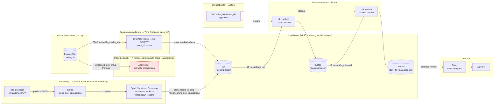

# Modern Data Stack

Bem-vindo ao laboratório de **Data Lakehouse** da Impacta! Este repositório reúne tudo o que você precisa para colocar a mão na massa e aprender, na prática, como funcionam as principais tecnologias do universo de Engenharia de Dados. Aqui, você vai experimentar desde a ingestão até a análise de dados, usando ferramentas modernas e amplamente utilizadas no mercado.

## Estrutura do Repositório

- **config**: Arquivos de configuração das tecnologias que você vai explorar nos exercícios.
- **resources**: Imagens, scripts e outros recursos essenciais para o laboratório funcionar perfeitamente.
- **volumes**: Arquivos de volumes, como configurações do Docker e outros itens necessários para rodar o ambiente.

## Tecnologias que Você Vai Usar

- **Docker**: Criação e gerenciamento dos containers das ferramentas do laboratório.
    - [Docker](https://www.docker.com/)

- **Apache Spark**: Processamento de grandes volumes de dados de forma distribuída.
    - [Apache Spark](https://spark.apache.org/docs/latest/)
- **Apache Kafka**: Streaming de dados em tempo real, essencial para pipelines modernos.
    - [Apache Kafka](https://kafka.apache.org/documentation/)
- **MiniO**: Simulação de um armazenamento de objetos compatível com o S3 da AWS.
    - [MinIO](https://min.io/docs/minio/container/index.html)
- **sales_db**: Banco transacional de exemplo (clientes, vendedores, produtos e pedidos) usado como fonte para os exercícios de ingestão e transformação — um case clássico de vendas, no estilo Northwind/Kimball.
- **SuperSet**: Visualização e análise de dados de maneira interativa.
    - [Apache Superset](https://superset.apache.org/docs/intro)
- **Apache Nifi**: Ingestão, integração e movimentação de dados entre sistemas.
    - [Apache Nifi](https://nifi.apache.org/docs/nifi-docs/)
- **LakeKeeper**: Gerenciamento de metadados no formato Apache Iceberg.
    - [LakeKeeper](https://docs.lakekeeper.io/docs/latest/concepts/)
- **Trino**: Consultas SQL distribuídas em grandes volumes de dados.
    - [Trino](https://trino.io/docs/current/)
- **dbt (dbt-trino)**: Transformação governada e testada dos dados — staging (raw → trusted) e fato/dimensão/data product (trusted → refined).
    - [dbt](https://docs.getdbt.com/) · [dbt-trino](https://github.com/starburstdata/dbt-trino)
- **Apache Airflow**: Orquestração e agendamento diário da execução do dbt.
    - [Apache Airflow](https://airflow.apache.org/docs/)

Explore, experimente e aproveite ao máximo este ambiente preparado especialmente para acelerar seu aprendizado em Engenharia de Dados!

## Execução do Ambiente
Para iniciar o ambiente do laboratório, você precisará ter o [Docker](https://www.docker.com/get-started/) instalado em sua máquina.

1. Clone este repositório:
   ```bash
   git clone https://github.com/stailer37/impacta-labs.git
   ```

2. Navegue até o diretório do repositório:
   ```bash
   cd impacta-labs/modern-data-stack
   ```

3. Execute o comando abaixo para iniciar os containers do Docker:
   ```bash
   # Linux/Mac
   bash begin-here-linux-mac.sh
   # Windows
   begin-here-windows.bat
   ```

4. Acesse as ferramentas através dos seguintes links:

| Serviço         | URL de Acesso                                    | Porta Padrão | Usuário/Senha                        |
|-----------------|--------------------------------------------------|--------------|--------------------------------------|
| MinIO Console   | [http://localhost:9001](http://localhost:9001)   | 9001         |admin/impacta2025                     |
| Kafka UI        | [http://localhost:8083](http://localhost:8083)   | 8083         |None/None                             |
| sales_db        | `postgresql://localhost:5432/sales_db`           | 5432         |sales_user/sales_pass                 |
| Superset        | [http://localhost:8088](http://localhost:8088)   | 8088         |admin/impacta2025                     |
| Apache Nifi     | [https://localhost:8443](https://localhost:8443) | 8443         |admin/ctsBtRBKHRAx69EqUghvvgEvjnaLjFEB|
| LakeKeeper      | [http://localhost:8181](http://localhost:8181)   | 8181         |None/None                             |
| Trino           | [http://localhost:8084](http://localhost:8084)   | 8084         |trino/None                            |
| Apache Airflow  | [http://localhost:8089](http://localhost:8089)   | 8089         |admin/impacta2025                     |
| Spark UI        | [http://localhost:4040](http://localhost:4040)   | 4040         |None/None                             |

> [!NOTE]
> O `dbt` não sobe como serviço de longa duração — ele é invocado sob demanda com `docker compose run --rm dbt <comando>` (veja a seção "Transformação de Dados com dbt"). Os serviços `pos_producer` e `spark_streaming` ficam no profile `streaming` e também não sobem com o `docker compose up -d` padrão — veja a seção "Streaming de Dados com Kafka e Spark Structured Streaming" para como ligá-los. A Spark UI em `4040` só fica disponível enquanto o `spark_streaming` está rodando.

## Como Praticar
Para começar a praticar, siga o passo a passo abaixo:
1. **Ingestão de Dados**: Utilize o Apache Nifi para criar um fluxo de dados que ingeste informações do `sales_db` e envie para o MinIO.
2. **Transformação de Dados**: Use o dbt para construir a camada `trusted` (com testes de qualidade) e a camada `refined` (fato/dimensão e um data product) a partir do Trino.
3. **Orquestração**: Use o Apache Airflow para agendar a execução diária do dbt em vez de rodar tudo manualmente.
4. **Streaming de Dados**: Use o Apache Kafka para receber eventos de venda em tempo real (emulados por um produtor local de PDV) e o Spark Structured Streaming para consumi-los e gravar na camada `raw` do lakehouse.
5. **Visualização de Dados**: Utilize o Apache Superset para criar dashboards e visualizar os dados através do Trino.

## Exercícios

### Ingestão de Dados com Apache Nifi

Visão geral do pipeline de ingestão batch do lab — do `sales_db` até o consumo via Trino/Superset, passando pelas camadas `raw` → `trusted` → `refined`, pela orquestração diária do Airflow e pelo caminho de streaming (PDV → Kafka → Spark) que alimenta a `raw` em paralelo:



> [!NOTE]
> O trecho em vermelho (`NiFi`) grava Parquet solto no bucket `raw` do MinIO, fora do catálogo Iceberg — é um exercício manual independente (ver seção "Ingestão de Dados com Apache Nifi") e ainda está pendente de rework para escrever direto em tabelas Iceberg. A camada `raw` que o dbt realmente lê (tabelas Iceberg) é carregada hoje via Trino, com `CREATE TABLE ... AS SELECT` direto do `sales_db` através do catálogo `postgresql` (ver seção "Transformação de Dados com dbt"). O caminho de streaming grava em `raw.streaming.pos_transactions` — uma tabela Iceberg separada das tabelas `raw.sales_db.*` usadas pelo dbt, então ela ainda não é consumida pela camada `trusted`/`refined` (ver seção "Streaming de Dados com Kafka e Spark Structured Streaming").

1. Crie um fluxo no Apache Nifi para ingestão de dados do `sales_db`.

    a. Configure o `QueryDatabaseTable` para conectar ao banco do `sales_db` e extrair dados.
    - No menu superior, clique em `Add Processor` e busque por `QueryDatabaseTable`.
    - Arraste o processador para o canvas e clique duas vezes nele para configurar.
    - Na aba `Properties`, configure as seguintes propriedades:
        - `Database Connection Pooling Service`: Crie um serviço de conexão com o banco de dados.
        - Em `Add Controller Service`, selecione `DBCPConnectionPool` e configure as propriedades:
            - `Database Connection URL`: Defina a URL de conexão como `jdbc:postgresql://sales_db:5432/sales_db`.
            - `Database Driver Class Name`: Defina como `org.postgresql.Driver`.
            - `Database User`: Defina o usuário do banco de dados `sales_user`.
            - `Database Password`: Defina a senha do banco de dados, por exemplo, `sales_pass`.
            - Valide as configurações clicando em `Verification`.
            - Em caso de sucesso, clique em `Apply` para salvar as configurações.
        - Habilite o controller service clicando no botão ≡ e selecionando `Enable`.
    - Nas configurações do `QueryDatabaseTable`, defina as seguintes propriedades:
        - `Database Type`: Selecione `PostgreSQL`.
        - `Table Name`: Defina como `customers`.
    - Apenas para conhecimento, é possível fazer ingestões de dados incrementais, para isso, os seguintes parâmetros devem ser alterados:
        - `Initial Load Strategy`: Selecione `Start at Beginning` para fazer uma carga completa ou configure o `Initial Load Strategy` como `Start at Current Maximum Values` para carregar controle de incremental.
            - Caso queira testar o modo incremental, defina o `Maximum-value Columns` como `created_at`
    - Por fim, altere o nível de log para `DEBUG` na aba `Settings`.
    - Clique em `Apply` para salvar as configurações.

    b. Use o `ConvertAvroToParquet` para converter os dados para o formato Parquet.
    - Adicione um novo processador `ConvertAvroToParquet` ao canvas.
    - Conecte o `QueryDatabaseTable` ao `ConvertAvroToParquet`.
    - Clique duas vezes no processador `ConvertAvroToParquet` para configurar.
    - Na aba `Properties`, configure as seguintes propriedades:
        - `Compression Type`: Defina como `SNAPPY` para compressão dos dados.
        - `Writer Version`: Defina como `PARQUET_2_0`.
    - Clique em `Apply` para salvar as configurações.
    
    c. Use o `PutS3Object` para enviar os dados para o MinIO.
    - Adicione um novo processador `PutS3Object` ao canvas.
    - Em propriedades, adicione um novo `AWS Credentials Provider Service` e configure as credenciais do MinIO no serviço:
        - `Access Key ID`: Defina como `4PRJYFLGzQYTnOJGH1gA`.
        - `Secret Access Key`: Defina como `ovBkCsqh2cXNkyoteCzQMV5JWCUk5tHfsG1GwYbD`.
        - Habilite o serviço clicando no botão ≡ e selecionando `Enable`.
    - Adicione os parametros de configuração do bucket no MinIO:
        - `Bucket`: Defina como `raw`.
        - `Object Key`: Defina como `sales_db/customers/${filename}`.
        - `Endpoint Override URL`: Defina como `http://minio:9000`.

    d. Conecte o `ConvertAvroToParquet` ao `PutS3Object`.
    e. Altere as `Relationships` do `ConvertAvroToParquet` `PutS3Object` para `success` e `failure`.
    f. Altere o nível de log para `DEBUG`
    g. Execute o fluxo clicando no botão de "play" no canto superior esquerdo do Apache Nifi.
    h. Verifique se os dados foram enviados corretamente para o MinIO acessando o console em [http://localhost:9001](http://localhost:9001).

- Lista de Tabelas do `sales_db`:

    Schema |    Name      | Type  |
    -------|--------------|-------|
    public | customers    | table |
    public | employees    | table |
    public | products     | table |
    public | orders       | table |
    public | order_items  | table |

2. Extraíndo todas as tabelas do `sales_db`.
    a. Adicione um novo processador `ListDatabaseTables` ao canvas, para listar todas as tabelas do `sales_db`.
    - Configure o processador `ListDatabaseTables` com as seguintes propriedades:
        - `Database Connection Pooling Service`: Selecione o serviço de conexão criado anteriormente.
        - `Schema Pattern`: public
        - `Table Name Pattern`: `%` (para listar todas as tabelas).
    
    b. Adicione um novo processador `ExecuteSQL` ao canvas, para executar a consulta SQL de extração dos dados.
    - Conecte o `ListDatabaseTables` ao `ExecuteSQL`.
    - Configure o processador `ExecuteSQL` com as seguintes propriedades:
        - `Database Connection Pooling Service`: Selecione o serviço de conexão criado anteriormente.
        - `SQL Query`: Defina como `SELECT * FROM ${db.table.name}` para extrair todos os dados da tabela.
    
    c. Conecte o `ExecuteSQL` ao `ConvertAvroToParquet` para converter os dados extraídos.
    
    d. Conecte o `ConvertAvroToParquet` ao `PutS3Object` para enviar os dados convertidos para o MinIO.
    
    e. Modifique o `Object Key` do `PutS3Object` para incluir o nome da tabela:
        - `Object Key`: Defina como `sales_db/${db.table.name}/${filename}`.
        - Altere a Region para `US East (N. Virginia)`
    
    f. Execute o fluxo clicando no botão de "play".
    
    g. Verifique se os dados foram enviados corretamente para o MinIO acessando o console em [http://localhost:9001](http://localhost:9001).

### Transformação de Dados com dbt
A camada `trusted` e a camada `refined` são construídas com **dbt** (adaptador [dbt-trino](https://github.com/starburstdata/dbt-trino)), em vez de código solto. O projeto fica em `volumes/dbt/sales_lakehouse/` e roda via `docker compose run`, no mesmo estilo hands-on dos outros exercícios — não é um serviço de longa duração.

0. Carregue a camada `raw` (tabelas Iceberg) a partir do `sales_db`, via Trino:
   - O catálogo `postgresql` `sales_db` (`configs/trino/etc/catalog/sales_db.properties`) conecta o Trino direto no banco transacional.
   - O warehouse `raw` precisa existir no Lakekeeper antes da primeira carga (já existem `trusted` e `refined` registrados do mesmo jeito):
     ```bash
     curl -s -X POST http://localhost:8181/management/v1/warehouse \
       -H "Content-Type: application/json" \
       -d @configs/lakekeeper/create-warehouse-raw.json
     ```
   - Com o warehouse criado, materialize cada tabela de origem como uma tabela Iceberg via `CREATE TABLE ... AS SELECT` (não precisa do NiFi nem do Spark para isso):
     ```bash
     docker compose exec -T trino trino --execute "CREATE SCHEMA IF NOT EXISTS raw.sales_db"
     for t in customers employees products orders order_items; do
       docker compose exec -T trino trino --execute "CREATE TABLE raw.sales_db.$t AS SELECT * FROM sales_db.public.$t"
     done
     ```
   > [!NOTE]
   > Esse é o caminho que hoje alimenta a camada `raw` que o dbt lê. O fluxo de ingestão via NiFi (seção "Ingestão de Dados com Apache Nifi") ainda só grava Parquet solto no bucket `raw` do MinIO — escrever tabelas Iceberg direto pelo NiFi é o rework pendente mencionado no diagrama acima.

1. Teste a conexão do dbt com o Trino:
   ```bash
   docker compose run --rm dbt debug
   ```
2. Construa a camada `trusted`, lendo da camada `raw`:
   ```bash
   docker compose run --rm dbt run --select trusted
   ```
3. Construa a camada `refined` (fato/dimensão e o data product), a partir do `trusted`:
   ```bash
   docker compose run --rm dbt run --select refined
   ```
4. Rode os testes de qualidade (unicidade e completude das chaves):
   ```bash
   docker compose run --rm dbt test
   ```

**Estrutura dos models:**
- `models/trusted/`: um model por tabela de origem (`stg_customers`, `stg_employees`, `stg_products`, `stg_orders`, `stg_order_items`), com testes `unique`/`not_null` nas chaves — isso é o que constrói a camada `trusted`.
- `models/refined/dim/` e `models/refined/fct/`: star schema clássico (`dim_customer`, `dim_employee`, `dim_product`, `dim_date`, `fct_sales`) — grain do fato é o item de pedido.
- `models/refined/data_products/sales_performance.sql`: o **data product** de vendas — `fct_sales` com as dimensões já achatadas, mas com governança de verdade em volta (`models/refined/data_products/_data_products.yml`): `description` em cada coluna, `meta.owner`/`meta.domain`, e `contract: enforced: true` (o schema é um contrato estável, não muda silenciosamente junto com a lógica interna). O consumo desse data product pelo Superset está documentado em `_exposures.yml`.

### Orquestração com Apache Airflow
A execução do dbt (`trusted` → `refined`) é agendada uma vez por dia via **Apache Airflow**, em vez de rodar só manualmente. A imagem do Airflow já vem com `dbt-trino` instalado (`configs/airflow/Dockerfile`) e a DAG roda os comandos dbt direto via `BashOperator`, sem Docker-in-Docker.

1. Acesse a UI do Airflow em [http://localhost:8089](http://localhost:8089) (usuário/senha: `admin`/`impacta2025`).
2. A DAG `sales_lakehouse_dbt` (`volumes/airflow/dags/sales_lakehouse_dbt_dag.py`) roda diariamente (`schedule="@daily"`) com 4 tasks em sequência:
   `dbt_run_trusted` → `dbt_test_trusted` → `dbt_run_refined` → `dbt_test_refined`.

> [!NOTE]
> A DAG depende da camada `raw` existir de verdade como tabelas Iceberg — se as tasks `dbt_run_trusted`/`dbt_test_trusted` falharem com `ICEBERG_CATALOG_ERROR`, é sinal de que a carga inicial da `raw` (passo 0 da seção "Transformação de Dados com dbt") ainda não foi feita. As tasks seguintes ficam `upstream_failed` em cascata até isso ser corrigido — não é um bug da DAG, é a dependência real entre as camadas.

Pra disparar a DAG manualmente (sem esperar o agendamento diário), use o botão "Trigger DAG" na UI ou:
```bash
docker exec modern-data-stack-airflow_scheduler-1 airflow dags trigger sales_lakehouse_dbt
```

### Conectando o Trino ao SuperSet
1. Abra o Apache Superset em [http://localhost:8088](http://localhost:8088).
2. Crie uma nova fonte de dados conectando ao Trino e consumindo a camada `trusted`:
    - Clique em `Settings` (encontra-se no canto superior direito) > `Data Connections` > `+ Database` (botão azul próximo ao `Settings`).
    - Selecione `Trino` como o tipo de banco de dados.
    - Preencha as informações de conexão:
        - `Display Name`: `Trusted`
        - `SQLAlchemy URI`: `trino://admin@trino:8080/trusted`

3. Crie uma nova fonte de dados conectando ao Trino e consumindo a camada `refined`:
    - Clique em `Settings` > `Data Connections` > `+ Database`.
    - Selecione `Trino` como o tipo de banco de dados.
    - Preencha as informações de conexão:
        - `Display Name`: `Refined`
        - `SQLAlchemy URI`: `trino://admin@trino:8080/refined`

### Explorando Dados com Apache Superset
> [!TIP]
> As duas primeiras queries são pra praticar SQL Lab direto contra `trusted` (dados crus, sem os joins/star schema do dbt). As de baixo já usam a camada `refined` — uma vez que o dbt rodou, o caminho recomendado é consultar `refined.marts.sales_performance` (o data product) ou o star schema (`fct_sales` + `dim_*`) direto, sem repetir os joins de `trusted` toda vez.

1. No Apache Superset, vá em `SQL` > `SQL Lab`, selecione a database `Trusted` e crie uma nova consulta SQL.
    a. Produtos Mais Vendidos
    ```sql
    SELECT
        p.product_name AS produto
        , SUM(oi.quantity) AS total_vendido
    FROM stg_order_items oi
    JOIN stg_products p ON oi.product_id = p.product_id
    GROUP BY p.product_name
    ORDER BY total_vendido DESC
    LIMIT 10;
    ```

    b. Clientes com Maior Gasto
    ```sql
    SELECT
        c.customer_name AS cliente
        , SUM(oi.quantity * oi.unit_price * (1 - oi.discount)) AS total_gasto
    FROM stg_customers c
    JOIN stg_orders o ON c.customer_id = o.customer_id
    JOIN stg_order_items oi ON o.order_id = oi.order_id
    GROUP BY 1
    ORDER BY total_gasto DESC
    LIMIT 10;
    ```

2. Depois de rodar `dbt run` e a camada `refined` estar construída, selecione a database `Refined` e crie uma nova consulta SQL.
    c. Receita por Categoria de Produto (via data product `sales_performance`, sem joins)
    ```sql
    SELECT
        product_category AS categoria
        , SUM(line_revenue) AS receita_total
    FROM marts.sales_performance
    GROUP BY product_category
    ORDER BY receita_total DESC;
    ```

    d. Receita Mensal por Região (via star schema `fct_sales` + `dim_date` + `dim_customer`)
    ```sql
    SELECT
        d.year
        , d.month
        , c.region AS regiao
        , SUM(f.line_revenue) AS receita_total
    FROM marts.fct_sales f
    JOIN marts.dim_date d ON d.date_day = f.order_date
    JOIN marts.dim_customer c ON c.customer_id = f.customer_id
    GROUP BY d.year, d.month, c.region
    ORDER BY d.year, d.month, regiao;
    ```

    e. Tempo Médio entre Pedido e Envio por Categoria (via data product `sales_performance`)
    ```sql
    SELECT
        product_category AS categoria
        , AVG(DATE_DIFF('day', order_date, ship_date)) AS tempo_medio_envio_dias
    FROM marts.sales_performance
    WHERE ship_date IS NOT NULL
    GROUP BY product_category
    ORDER BY tempo_medio_envio_dias DESC;
    ```

### Streaming de Dados com Kafka e Spark Structured Streaming
Em vez de um notebook produzindo e consumindo mensagens manualmente, esse exercício usa dois serviços de longa duração que sobem via Docker: o `pos_producer` (um script Python que emula um ponto de venda, gerando vendas sintéticas a partir dos clientes/funcionários/produtos já cadastrados no `sales_db`) e o `spark_streaming` (uma aplicação PySpark Structured Streaming, rodada com `spark-submit`, que consome o tópico Kafka e grava como tabela Iceberg na camada `raw`).

> [!NOTE]
> Os dois serviços ficam no profile `streaming` do `docker-compose.yml`, então não sobem com o `docker compose up -d` padrão — é preciso subi-los explicitamente (passo 2). O `spark_streaming` também depende do warehouse `raw` já existir no Lakekeeper (passo 0 da seção "Transformação de Dados com dbt") — sem isso, ele vai falhar ao criar o schema/tabela Iceberg.

1. Crie o tópico `pos_transactions` no Kafka.
    - Abra o Kafka UI em [http://localhost:8083](http://localhost:8083).
    - Vá em `Topics` > `Add a Topic` e configure:
        - **Topic Name**: pos_transactions
        - **Partitions**: 1 (para simplificar o ambiente de desenvolvimento)
        - **Cleanup Policy**: `Delete`
        - **Replication Factor**: 1 (para simplificar o ambiente de desenvolvimento)
        - **Retention**: 12 horas (para economia de armazenamento)

2. Suba o produtor (emulador de PDV) e a aplicação Spark Streaming:
    ```bash
    docker compose --profile streaming up -d pos_producer spark_streaming
    ```
    - O `pos_producer` (`configs/pos_producer/producer.py`) conecta direto no `sales_db` para puxar `customer_id`/`employee_id`/`product_id` reais e, a cada ~2 segundos, simula um "carrinho" fechado no caixa: 1 a 4 itens com o mesmo `transaction_id`, loja (`store_id`), caixa (`register_id`), vendedor, forma de pagamento e, opcionalmente, cliente (carrinhos sem cliente identificado simulam venda sem cadastro/fidelidade). Cada item vira uma mensagem JSON publicada no tópico `pos_transactions`:
      ```json
      {
          "transaction_id": "f47ac10b-58cc-4372-a567-0e02b2c3d479",
          "event_timestamp": "2026-06-22T14:32:10.123456+00:00",
          "store_id": "STORE-03",
          "register_id": 2,
          "employee_id": 7,
          "customer_id": 123,
          "product_id": 45,
          "quantity": 2,
          "unit_price": 19.9,
          "discount": 0.05,
          "payment_method": "credit_card"
      }
      ```
    - O `spark_streaming` (`configs/spark/streaming_app.py`) sobe via `spark-submit` com os pacotes `spark-sql-kafka`, `iceberg-spark-runtime` e `iceberg-aws-bundle`, lê o tópico `pos_transactions` em modo streaming (`readStream`), faz o parse do JSON e grava em modo `append` (gatilho de 10 em 10 segundos) na tabela Iceberg `raw.streaming.pos_transactions`, via catálogo REST do Lakekeeper.

3. Acompanhe os dois lados do pipeline:
    - No Kafka UI, em `Topics` > `pos_transactions` > `Messages`, as mensagens publicadas pelo `pos_producer` devem aparecer.
    - Nos logs do `spark_streaming` (`docker compose logs -f spark_streaming`) ou na Spark UI em [http://localhost:4040](http://localhost:4040), acompanhe os micro-batches sendo processados.
    - Para conferir os dados já gravados na lakehouse, consulte via Trino (catálogo `raw`):
      ```bash
      docker compose exec -T trino trino --execute "SELECT * FROM raw.streaming.pos_transactions ORDER BY ingestion_timestamp DESC LIMIT 10"
      ```

4. Para encerrar o exercício sem afetar o resto do ambiente:
    ```bash
    docker compose stop pos_producer spark_streaming
    ```
    O checkpoint do streaming fica em `s3a://raw/_checkpoints/pos_transactions` — ao subir o `spark_streaming` de novo, ele retoma de onde parou em vez de reprocessar tudo.