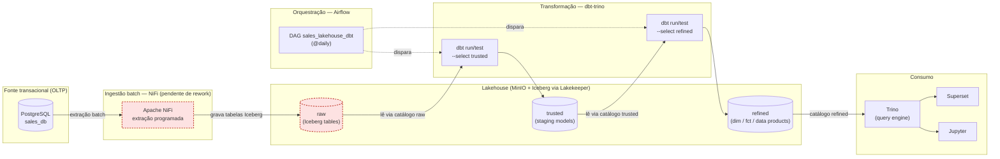

# Modern Data Stack

Bem-vindo ao laboratório de **Data Lakehouse** da Impacta! Este repositório reúne tudo o que você precisa para colocar a mão na massa e aprender, na prática, como funcionam as principais tecnologias do universo de Engenharia de Dados. Aqui, você vai experimentar desde a ingestão até a análise de dados, usando ferramentas modernas e amplamente utilizadas no mercado.

## Estrutura do Repositório

- **config**: Arquivos de configuração das tecnologias que você vai explorar nos exercícios.
- **resources**: Imagens, scripts e outros recursos essenciais para o laboratório funcionar perfeitamente.
- **volumes**: Arquivos de volumes, como configurações do Docker e outros itens necessários para rodar o ambiente.

## Tecnologias que Você Vai Usar

- **Docker**: Criação e gerenciamento dos containers das ferramentas do laboratório.
    - [Docker](https://www.docker.com/)

- **Apache Spark**: Processamento de grandes volumes de dados de forma distribuída.
    - [Apache Spark](https://spark.apache.org/docs/latest/)
- **Apache Kafka**: Streaming de dados em tempo real, essencial para pipelines modernos.
    - [Apache Kafka](https://kafka.apache.org/documentation/)
- **MiniO**: Simulação de um armazenamento de objetos compatível com o S3 da AWS.
    - [MinIO](https://min.io/docs/minio/container/index.html)
- **sales_db**: Banco transacional de exemplo (clientes, vendedores, produtos e pedidos) usado como fonte para os exercícios de ingestão e transformação — um case clássico de vendas, no estilo Northwind/Kimball.
- **SuperSet**: Visualização e análise de dados de maneira interativa.
    - [Apache Superset](https://superset.apache.org/docs/intro)
- **Apache Nifi**: Ingestão, integração e movimentação de dados entre sistemas.
    - [Apache Nifi](https://nifi.apache.org/docs/nifi-docs/)
- **LakeKeeper**: Gerenciamento de metadados no formato Apache Iceberg.
    - [LakeKeeper](https://docs.lakekeeper.io/docs/latest/concepts/)
- **Trino**: Consultas SQL distribuídas em grandes volumes de dados.
    - [Trino](https://trino.io/docs/current/)
- **dbt (dbt-trino)**: Transformação governada e testada dos dados — staging (raw → trusted) e fato/dimensão/data product (trusted → refined).
    - [dbt](https://docs.getdbt.com/) · [dbt-trino](https://github.com/starburstdata/dbt-trino)
- **Apache Airflow**: Orquestração e agendamento diário da execução do dbt.
    - [Apache Airflow](https://airflow.apache.org/docs/)

Explore, experimente e aproveite ao máximo este ambiente preparado especialmente para acelerar seu aprendizado em Engenharia de Dados!

## Execução do Ambiente
Para iniciar o ambiente do laboratório, você precisará ter o [Docker](https://www.docker.com/get-started/) instalado em sua máquina.

1. Clone este repositório:
   ```bash
   git clone https://github.com/stailer37/impacta-labs.git
   ```

2. Navegue até o diretório do repositório:
   ```bash
   cd impacta-labs/modern-data-stack
   ```

3. Execute o comando abaixo para iniciar os containers do Docker:
   ```bash
   # Linux/Mac
   bash begin-here-linux-mac.sh
   # Windows
   begin-here-windows.bat
   ```

4. Acesse as ferramentas através dos seguintes links:

| Serviço         | URL de Acesso                                    | Porta Padrão | Usuário/Senha                        |
|-----------------|--------------------------------------------------|--------------|--------------------------------------|
| MinIO Console   | [http://localhost:9001](http://localhost:9001)   | 9001         |admin/impacta2025                     |
| Kafka UI        | [http://localhost:8083](http://localhost:8083)   | 8083         |None/None                             |
| sales_db        | `postgresql://localhost:5432/sales_db`           | 5432         |sales_user/sales_pass                 |
| Superset        | [http://localhost:8088](http://localhost:8088)   | 8088         |admin/impacta2025                     |
| Apache Nifi     | [https://localhost:8443](https://localhost:8443) | 8443         |admin/ctsBtRBKHRAx69EqUghvvgEvjnaLjFEB|
| LakeKeeper      | [http://localhost:8181](http://localhost:8181)   | 8181         |None/None                             |
| Trino           | [http://localhost:8084](http://localhost:8084)   | 8084         |trino/None                            |
| Apache Airflow  | [http://localhost:8089](http://localhost:8089)   | 8089         |admin/impacta2025                     |

> [!NOTE]
> O `dbt` não sobe como serviço de longa duração — ele é invocado sob demanda com `docker compose run --rm dbt <comando>` (veja a seção "Transformação de Dados com dbt").

## Como Praticar
Para começar a praticar, siga o passo a passo abaixo:
1. **Ingestão de Dados**: Utilize o Apache Nifi para criar um fluxo de dados que ingeste informações do `sales_db` e envie para o MinIO.
2. **Transformação de Dados**: Use o dbt para construir a camada `trusted` (com testes de qualidade) e a camada `refined` (fato/dimensão e um data product) a partir do Trino.
3. **Orquestração**: Use o Apache Airflow para agendar a execução diária do dbt em vez de rodar tudo manualmente.
4. **Streaming de Dados**: Configure o Apache Kafka para receber dados em tempo real e o Spark Streaming para processa-los.
5. **Visualização de Dados**: Utilize o Apache Superset para criar dashboards e visualizar os dados através do Trino.

## Exercícios

### Ingestão de Dados com Apache Nifi

Visão geral do pipeline de ingestão batch do lab — do `sales_db` até o consumo via Trino/Superset/Jupyter, passando pelas camadas `raw` → `trusted` → `refined` e pela orquestração diária do Airflow:



> [!NOTE]
> O trecho em vermelho (`NiFi` → `raw`) representa o rework de ingestão ainda pendente — é o mesmo motivo pelo qual `dbt_run_trusted` falha hoje na DAG do Airflow (ver seção "Orquestração com Apache Airflow").

1. Crie um fluxo no Apache Nifi para ingestão de dados do `sales_db`.

    a. Configure o `QueryDatabaseTable` para conectar ao banco do `sales_db` e extrair dados.
    - No menu superior, clique em `Add Processor` e busque por `QueryDatabaseTable`.
    - Arraste o processador para o canvas e clique duas vezes nele para configurar.
    - Na aba `Properties`, configure as seguintes propriedades:
        - `Database Connection Pooling Service`: Crie um serviço de conexão com o banco de dados.
        - Em `Add Controller Service`, selecione `DBCPConnectionPool` e configure as propriedades:
            - `Database Connection URL`: Defina a URL de conexão como `jdbc:postgresql://sales_db:5432/sales_db`.
            - `Database Driver Class Name`: Defina como `org.postgresql.Driver`.
            - `Database User`: Defina o usuário do banco de dados `sales_user`.
            - `Database Password`: Defina a senha do banco de dados, por exemplo, `sales_pass`.
            - Valide as configurações clicando em `Verification`.
            - Em caso de sucesso, clique em `Apply` para salvar as configurações.
        - Habilite o controller service clicando no botão ≡ e selecionando `Enable`.
    - Nas configurações do `QueryDatabaseTable`, defina as seguintes propriedades:
        - `Database Type`: Selecione `PostgreSQL`.
        - `Table Name`: Defina como `customers`.
    - Apenas para conhecimento, é possível fazer ingestões de dados incrementais, para isso, os seguintes parâmetros devem ser alterados:
        - `Initial Load Strategy`: Selecione `Start at Beginning` para fazer uma carga completa ou configure o `Initial Load Strategy` como `Start at Current Maximum Values` para carregar controle de incremental.
            - Caso queira testar o modo incremental, defina o `Maximum-value Columns` como `created_at`
    - Por fim, altere o nível de log para `DEBUG` na aba `Settings`.
    - Clique em `Apply` para salvar as configurações.

    b. Use o `ConvertAvroToParquet` para converter os dados para o formato Parquet.
    - Adicione um novo processador `ConvertAvroToParquet` ao canvas.
    - Conecte o `QueryDatabaseTable` ao `ConvertAvroToParquet`.
    - Clique duas vezes no processador `ConvertAvroToParquet` para configurar.
    - Na aba `Properties`, configure as seguintes propriedades:
        - `Compression Type`: Defina como `SNAPPY` para compressão dos dados.
        - `Writer Version`: Defina como `PARQUET_2_0`.
    - Clique em `Apply` para salvar as configurações.
    
    c. Use o `PutS3Object` para enviar os dados para o MinIO.
    - Adicione um novo processador `PutS3Object` ao canvas.
    - Em propriedades, adicione um novo `AWS Credentials Provider Service` e configure as credenciais do MinIO no serviço:
        - `Access Key ID`: Defina como `4PRJYFLGzQYTnOJGH1gA`.
        - `Secret Access Key`: Defina como `ovBkCsqh2cXNkyoteCzQMV5JWCUk5tHfsG1GwYbD`.
        - Habilite o serviço clicando no botão ≡ e selecionando `Enable`.
    - Adicione os parametros de configuração do bucket no MinIO:
        - `Bucket`: Defina como `raw`.
        - `Object Key`: Defina como `sales_db/customers/${filename}`.
        - `Endpoint Override URL`: Defina como `http://minio:9000`.

    d. Conecte o `ConvertAvroToParquet` ao `PutS3Object`.
    e. Altere as `Relationships` do `ConvertAvroToParquet` `PutS3Object` para `success` e `failure`.
    f. Altere o nível de log para `DEBUG`
    g. Execute o fluxo clicando no botão de "play" no canto superior esquerdo do Apache Nifi.
    h. Verifique se os dados foram enviados corretamente para o MinIO acessando o console em [http://localhost:9001](http://localhost:9001).

- Lista de Tabelas do `sales_db`:

    Schema |    Name      | Type  |
    -------|--------------|-------|
    public | customers    | table |
    public | employees    | table |
    public | products     | table |
    public | orders       | table |
    public | order_items  | table |

2. Extraíndo todas as tabelas do `sales_db`.
    a. Adicione um novo processador `ListDatabaseTables` ao canvas, para listar todas as tabelas do `sales_db`.
    - Configure o processador `ListDatabaseTables` com as seguintes propriedades:
        - `Database Connection Pooling Service`: Selecione o serviço de conexão criado anteriormente.
        - `Schema Pattern`: public
        - `Table Name Pattern`: `%` (para listar todas as tabelas).
    
    b. Adicione um novo processador `ExecuteSQL` ao canvas, para executar a consulta SQL de extração dos dados.
    - Conecte o `ListDatabaseTables` ao `ExecuteSQL`.
    - Configure o processador `ExecuteSQL` com as seguintes propriedades:
        - `Database Connection Pooling Service`: Selecione o serviço de conexão criado anteriormente.
        - `SQL select query`: Defina como `SELECT * FROM ${db.table.name}` para extrair todos os dados da tabela.
    
    c. Conecte o `ExecuteSQL` ao `ConvertAvroToParquet` para converter os dados extraídos.
    
    d. Conecte o `ConvertAvroToParquet` ao `PutS3Object` para enviar os dados convertidos para o MinIO.
    
    e. Modifique o `Object Key` do `PutS3Object` para incluir o nome da tabela:
        - `Object Key`: Defina como `sales_db/${db.table.name}/${filename}`.
    
    f. Execute o fluxo clicando no botão de "play".
    
    g. Verifique se os dados foram enviados corretamente para o MinIO acessando o console em [http://localhost:9001](http://localhost:9001).

### Processamento de Dados com Apache Spark
1. Criando um job no Apache Spark para processar os dados do MinIO e gerar tabelas em formato de Lake House.
    - Abra o Notebook Jupyter em [http://localhost:8888](http://localhost:8888), abra a pasta `examples` e selecione o notebook `spark_batch.ipynb`.
    - No notebook, você encontrará células de código já preparadas para ler os dados do MinIO, processá-los e salvá-los no formato Iceberg.

> [!WARNING]
> Os notebooks em `volumes/jupyter/notebooks/` (`spark_batch.ipynb`, `kafka_producer.ipynb`, `spark_streaming.ipynb`, `trino.ipynb`) ainda não foram migrados pro domínio de vendas — eles seguem com os nomes de tabela do dataset anterior (Pagila) e precisam de atualização antes de rodar contra o `sales_db`. Essa migração é um próximo passo separado deste lab.

### Transformação de Dados com dbt
A camada `trusted` e a camada `refined` são construídas com **dbt** (adaptador [dbt-trino](https://github.com/starburstdata/dbt-trino)), em vez de código solto. O projeto fica em `volumes/dbt/sales_lakehouse/` e roda via `docker compose run`, no mesmo estilo hands-on dos outros exercícios — não é um serviço de longa duração.

1. Teste a conexão do dbt com o Trino:
   ```bash
   docker compose run --rm dbt debug
   ```
2. Construa a camada `trusted`, lendo da camada `raw`:
   ```bash
   docker compose run --rm dbt run --select trusted
   ```
   > [!NOTE]
   > Esse comando só roda de ponta a ponta depois que a camada `raw` existir como tabelas Iceberg (catálogo Trino `raw`, ainda sem warehouse criado no Lakekeeper — isso faz parte de um rework futuro do fluxo de ingestão do NiFi). Até lá, os models de `trusted` existem prontos no projeto, mas falham na execução por falta de dados de origem. Pra validar só a sintaxe sem rodar de verdade, use `docker compose run --rm dbt compile --select trusted`.
3. Construa a camada `refined` (fato/dimensão e o data product), a partir do `trusted`:
   ```bash
   docker compose run --rm dbt run --select refined
   ```
4. Rode os testes de qualidade (unicidade e completude das chaves):
   ```bash
   docker compose run --rm dbt test
   ```

**Estrutura dos models:**
- `models/trusted/`: um model por tabela de origem (`stg_customers`, `stg_employees`, `stg_products`, `stg_orders`, `stg_order_items`), com testes `unique`/`not_null` nas chaves — isso é o que constrói a camada `trusted`.
- `models/refined/dim/` e `models/refined/fct/`: star schema clássico (`dim_customer`, `dim_employee`, `dim_product`, `dim_date`, `fct_sales`) — grain do fato é o item de pedido.
- `models/refined/data_products/sales_performance.sql`: o **data product** de vendas — `fct_sales` com as dimensões já achatadas, mas com governança de verdade em volta (`models/refined/data_products/_data_products.yml`): `description` em cada coluna, `meta.owner`/`meta.domain`, e `contract: enforced: true` (o schema é um contrato estável, não muda silenciosamente junto com a lógica interna). O consumo desse data product pelo Superset está documentado em `_exposures.yml`.

### Orquestração com Apache Airflow
A execução do dbt (`trusted` → `refined`) é agendada uma vez por dia via **Apache Airflow**, em vez de rodar só manualmente. A imagem do Airflow já vem com `dbt-trino` instalado (`configs/airflow/Dockerfile`) e a DAG roda os comandos dbt direto via `BashOperator`, sem Docker-in-Docker.

1. Acesse a UI do Airflow em [http://localhost:8089](http://localhost:8089) (usuário/senha: `admin`/`impacta2025`).
2. A DAG `sales_lakehouse_dbt` (`volumes/airflow/dags/sales_lakehouse_dbt_dag.py`) roda diariamente (`schedule="@daily"`) com 4 tasks em sequência:
   `dbt_run_trusted` → `dbt_test_trusted` → `dbt_run_refined` → `dbt_test_refined`.

> [!WARNING]
> A DAG modela o pipeline completo na ordem certa, então `dbt_run_trusted` falha todo dia até a camada `raw` existir de verdade (mesmo motivo do aviso da seção anterior) — as tasks seguintes ficam `upstream_failed` em cascata. Isso é esperado, não um bug da DAG: o jeito certo de corrigir é terminar o rework do NiFi pra camada `raw`, não pular a dependência real entre as camadas.

Pra disparar a DAG manualmente (sem esperar o agendamento diário), use o botão "Trigger DAG" na UI ou:
```bash
docker exec modern-data-stack-airflow_scheduler-1 airflow dags trigger sales_lakehouse_dbt
```

### Conectando o Trino ao SuperSet
1. Abra o Apache Superset em [http://localhost:8088](http://localhost:8088).
2. Crie uma nova fonte de dados conectando ao Trino:
    - Clique em `Settings` (encontra-se no canto superior direito) > `Data Connections` > `+ Database` (botão azul próximo ao `Settings`).
    - Selecione `Trino` como o tipo de banco de dados.
    - Preencha as informações de conexão:
        - `SQLAlchemy URI`: `trino://admin@trino:8080/trusted`

### Explorando Dados com Apache Superset
> [!TIP]
> As queries abaixo são para praticar SQL Lab direto contra `trusted`. Depois que a camada `refined` estiver construída pelo dbt, o caminho recomendado é consultar `refined.marts.sales_performance` (o data product) ou `refined.marts.fct_sales` direto, sem precisar repetir esses joins toda vez.

1. No Apache Superset, vá em `SQL` > `SQL Lab` e crie uma nova consulta SQL.
    a. Produtos Mais Vendidos
    ```sql
    SELECT
        p.product_name AS produto
        , SUM(oi.quantity) AS total_vendido
    FROM order_items oi
    JOIN products p ON oi.product_id = p.product_id
    GROUP BY p.product_name
    ORDER BY total_vendido DESC
    LIMIT 10;
    ```

    b. Receita por Categoria de Produto
    ```sql
    SELECT
        p.category AS categoria
        , SUM(oi.quantity * oi.unit_price * (1 - oi.discount)) AS receita_total
    FROM order_items oi
    JOIN products p ON oi.product_id = p.product_id
    GROUP BY p.category
    ORDER BY receita_total DESC;
    ```

    c. Clientes com Maior Gasto
    ```sql
    SELECT
        c.customer_name AS cliente
        , SUM(oi.quantity * oi.unit_price * (1 - oi.discount)) AS total_gasto
    FROM customers c
    JOIN orders o ON c.customer_id = o.customer_id
    JOIN order_items oi ON o.order_id = oi.order_id
    GROUP BY 1
    ORDER BY total_gasto DESC
    LIMIT 10;
    ```

    d. Pedidos por Mês
    ```sql
    SELECT
        DATE_FORMAT(order_date, '%Y-%m') AS mes
        , COUNT(DISTINCT order_id) AS total_pedidos
    FROM orders
    GROUP BY 1
    ORDER BY 1;
    ```

    e. Tempo Médio entre Pedido e Envio por Categoria
    ```sql
    SELECT
        p.category AS categoria,
        AVG(DATE_DIFF('day', o.order_date, o.ship_date)) AS tempo_medio_envio_dias
    FROM orders o
    JOIN order_items oi ON o.order_id = oi.order_id
    JOIN products p ON oi.product_id = p.product_id
    WHERE o.ship_date IS NOT NULL
    GROUP BY p.category
    ORDER BY tempo_medio_envio_dias DESC;
    ```

### Stream de Dados com Apache Kafka
1. Configure o Apache Kafka para receber dados em tempo real.
    - Abra o Kafka UI em [http://localhost:8083](http://localhost:8083).
    - Crie um novo tópico chamado `popular_critics` para receber os dados de avaliação de filmes, com as seguintes configurações:
        - **Topic Name**: popular_critics
        - **Partitions**: 1 (para simplificar o ambiente de desenvolvimento)
        - **Cleanup Policy**: `Delete`
        > [!NOTE]
        > Tipos de Cleanup Policy:
        > - `Delete`: mensagens são removidas após o período de retenção.
        > - `Compact`: mantém apenas a última mensagem por chave, útil para dados de estado.
        > - `Compact, Delete`: combina as duas políticas, mantendo a última mensagem por chave e removendo mensagens antigas após o período de retenção.
        - **Replication Factor**: 1 (para simplificar o ambiente de desenvolvimento)
        - **Retention**: 12 horas (para econômica de armazenamento)
    

2. Crie uma mensagem de exemplo para enviar dados para o tópico `popular_critics`.
    - No Kafka UI, vá para `Topics` > `popular_critics` > `Produce Message`.
    - Envie o payload de exemplo abaixo no campo de `Value`:
    ```json
    {
        "name": "John Farnsworth",
        "film": "Agent Truman",
        "rating": 9,
        "review": "A mind-bending thriller that keeps you on the edge of your seat."
    }
    ```

3. Verifique se a mensagem foi recebida corretamente no tópico `popular_critics`.
    - Vá para `Topics` > `popular_critics` > `Messages`.
    - Você deve ver a mensagem que acabou de enviar.

### Produzindo e Consumindo Dados com Apache Kafka
1. Criando um `producer` e `consumer` para o tópico `popular_critics`.
    - Abra o Jupyter Notebook em [http://localhost:8888](http://localhost:8888) e selecione o notebook `kafka_producer.ipynb`.
    - No notebook, você encontrará células de código já preparadas para produzir e consumir mensagens do tópico `popular_critics`.