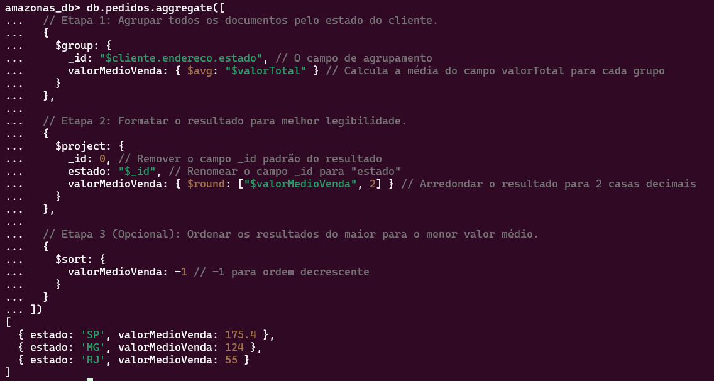

Nome: Daniel Silva Ramos

# Caso de Estudo NoSQL Documento

## Contexto

A empresa Amazonas do ramo de e-commerce deseja acompanhar os fluxos de cliques de seus clientes,
bem como rastrear os produtos que eles compram.Neste momento, a empresa vende livros, CDs e pequenos
eletrodomésticos de cozinha apenas, mas provavelmente irá expandir para outros produtos no futuro.

## Atividade

Amazonas quer ser capaz de responder às seguintes perguntas:

- Qual é a média de produtos comprados por cliente?
- Quais são os 20 produtos mais populares por estado dos clientes?
- Qual é o valor médio das vendas por estado do cliente?
- Quantos de cada tipo de produto foram vendidos nos últimos 30 dias?

1. Vocês foram contratados para decidir qual a melhor maneira de organizar esses dados,
seja em uma coleção única ou múltiplas, e devem definir quais campos específicos que cada produto deve ter e os porquês.
2. Devem produzir um ou mais eventos de sistêmicos no formato JSON para exemplificar as decisões.
3. Devem escolher uma das quatro perguntas de negócio e gerar um comando MongoDB para responder.

* Cada representante do grupo irá criar uma branch do repositório impacta-labs com a seguinte estrutura:
`feat/caso_estudo_{nome_do_grupo}`
* Enviar um pull request contendo os artefatos:
Arquivo README.MD com os integrantes do grupo (fiquem a vontade para explicar os porquês das decisões no documento)
`collection_{nome_a_escolha}.json` (caso optem por mais de uma collection, deverá haver mais de um arquivo JSON)
command_mongo.sh

## Resolução

**1**  A escolha definida foi seguir com coleção única chamada `pedidos`, assim a resposta para qualquer análise é feita olhando apenas uma coleção
Os campos selecionados foram:

`_id` (ObjectId): Identificador único do pedido, gerado automaticamente pelo MongoDB.

`dataPedido` (ISODate): Data e hora em que o pedido foi realizado. Essencial para filtros temporais, como a pergunta sobre os "últimos 30 dias".

`status` (String): Status atual do pedido (ex: "Processando", "Enviado", "Entregue").

`cliente` (Object): Um subdocumento com os dados do cliente no momento da compra.

`clienteId` (String/ObjectId): ID único do cliente para referência, caso exista uma coleção de clientes para outros fins (ex: autenticação).

`nome` (String): Nome do cliente.

`endereco` (Object): Endereço de entrega.

`logradouro` (String): Rua, avenida, etc.

`cidade` (String): Cidade.

`estado` (String): Sigla do estado (ex: "SP", "RJ"). Crucial para as perguntas de negócio baseadas em localização.

`cep` (String): Código de Endereçamento Postal.

`itens` (Array of Objects): Uma lista contendo todos os produtos comprados.

`produtoId` (String/ObjectId): ID de referência do produto.

`nomeProduto` (String): Nome do produto. Facilita a exibição do pedido sem precisar consultar outra coleção.

`categoria` (String): Categoria do produto ("Livros", "CDs", "Eletrodomésticos"). Fundamental para a pergunta sobre vendas por tipo de produto.

`quantidade` (Integer): Quantidade de unidades compradas deste item.

`precoUnitario` (Decimal): Preço do produto no momento da compra. Armazenar o preço aqui garante a integridade histórica, já que o preço do produto pode mudar no futuro.

`valorTotal` (Decimal): Soma total do pedido (quantidade * precoUnitario para todos os itens).

**2** O exemplo está no arquivo [collection_pedidos.json](collection_pedidos.json)

**3** Para responder a pergunta `Qual é o valor médio das vendas por estado do cliente?`

```bash
db.pedidos.aggregate([
  // Etapa 1: Agrupar todos os documentos pelo estado do cliente.
  {
    $group: {
      _id: "$cliente.endereco.estado", // O campo de agrupamento
      valorMedioVenda: { $avg: "$valorTotal" } // Calcula a média do campo valorTotal para cada grupo
    }
  },

  // Etapa 2: Formatar o resultado para melhor legibilidade.
  {
    $project: {
      _id: 0, // Remover o campo _id padrão do resultado
      estado: "$_id", // Renomear o campo _id para "estado"
      valorMedioVenda: { $round: ["$valorMedioVenda", 2] } // Arredondar o resultado para 2 casas decimais
    }
  },

  // Etapa 3 (Opcional): Ordenar os resultados do maior para o menor valor médio.
  {
    $sort: {
      valorMedioVenda: -1 // -1 para ordem decrescente
    }
  }
])

```

