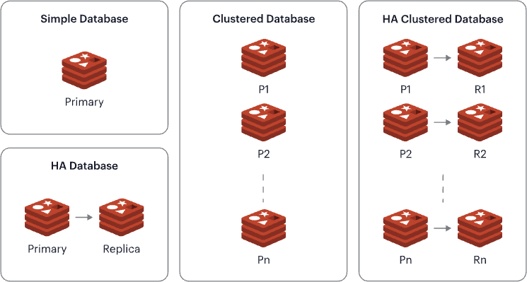

## 1. Fundamentos do Redis

### 1.1 Introdução ao Redis
O Redis (REmote DIctionary Server) é um banco de dados NoSQL de código aberto, conhecido por sua alta performance, flexibilidade e suporte a diversos tipos de dados. Ele é frequentemente utilizado como um armazenamento em cache, sistema de mensagens e banco de dados primário para aplicações que exigem baixa latência e alta taxa de transferência.

### 1.2 Componentes Principais
- **Servidor Redis**: O núcleo do Redis, responsável por gerenciar os dados e responder às solicitações dos clientes.
- **Clientes Redis**: Bibliotecas e ferramentas que permitem a comunicação com o servidor Redis a partir de diferentes linguagens de programação.

### 1.3 Arquitetura do Redis
O Redis possui uma arquitetura simples, suportando alta disponibilidade e escalabilidade através de mecanismos como replicação, particionamento e persistência de dados.

- **Database Simples**: um único shard primário que lida com todas as operações de leitura e escrita.
- **Alta Disponibilidade**: utilizando Redis Sentinel para monitorar instâncias e realizar failover automático.
- **Database Clusterizado**: múltiplos shards distribuídos para escalabilidade horizontal, permitindo que os dados sejam divididos entre várias instâncias do Redis.

A imagem abaixo ilustra a arquiteturas básicas do Redis:

Cada banco de dados do Redis pode ser acessado de diversas maneiras:
- **Endpoint do banco de dados**: Basta conectar sua aplicação ao endpoint do banco de dados (uma URL e porta exclusivas em um nome de domínio totalmente qualificado), e o Redis Enterprise irá gerenciar automaticamente toda a escalabilidade e operações de failover.
- **API Sentinel**: Utilize o protocolo Sentinel para conectar-se ao nó correto no cluster e acessar seu banco de dados.
- **API OSS Cluster**: Use a API de cluster para conectar-se diretamente a cada shard do seu cluster, sem etapas intermediárias.
